# OSDU R3 end-to-end data contract

## Decision

OSDU R3 is the backbone and the only persistence, identity, ingestion, security,
legal, discovery and lineage contract. The 18-node Arganta model is supplementary:
it is a read/navigation projection of OSDU and adds a concept only when the pinned
OSDU definitions have no equivalent. It never competes with or duplicates an
available OSDU kind.

Pinned definitions: OSDU Data Definitions **M27 / v0.30.0**, commit
`99f8fc88d8ad838b5738ac5ad92ac643538b5766`. Schema upgrades are reviewed and
versioned; `kind` versions never float.

## Pipeline

```mermaid
flowchart LR
  S["Sources: GOGET · USGS · regulators · Volve · internal"] -->
  L["Immutable source landing"]
  L --> N["Source adapter + units/identity normalization"]
  N --> G["ACL + LegalTag + dataClass"]
  G --> M["OSDU Manifest 1.0.0"]
  M --> V["Envelope and schema preflight"]
  V --> I["OSDU workflow / storage ingestion"]
  I --> Q["Search + lineage + ATLAS read model"]
```

Production deployment submits the emitted manifest to the platform's OSDU Manifest
Ingestion workflow. The local builder performs deterministic mapping and envelope
preflight; the target OSDU Schema and Storage services remain the final authority.

## Source lanes

| Lane | Role | Classification | Output |
|---|---|---|---|
| GOGET | Global field/asset identity spine | public | `goget.manifest.json` |
| USGS | Regions, basins, petroleum systems, assessment units | public | `usgs.manifest.json` |
| NOD/NSTA | Licences, organisations, fields, wells and wellbores | public | `north-sea.manifest.json` |
| Volve | Field-specific wells, logs, trajectories, production and interpretations | public or internal per source object | detail WPC/dataset manifests |
| Arganta internal | Interpretations, models, economics, partner facts | internal/confidential/restricted | separate protected manifests |

GOGET is identity/master metadata, not a container for logs, grids or production
series. Field-specific packages link to the GOGET/regulator Field record by reviewed
identity edges.

## The 18-entity mapping

| ATLAS entity | OSDU kind | Status |
|---|---|---|
| world, region, country | `master-data--GeoPoliticalEntity:1.1.0` | standard |
| basin | `master-data--Basin:1.2.0` | standard |
| petroleum-system | `arganta:master-data--PetroleumSystem:1.0.0` | OSDU extension |
| assessment-unit | `arganta:master-data--AssessmentUnit:1.0.0` | OSDU extension |
| play | `master-data--Play:1.1.0` | standard |
| prospect | `master-data--Prospect:1.1.0` | standard |
| field | `master-data--Field:1.1.0` | standard |
| reservoir | `master-data--Reservoir:2.0.0` | standard |
| well | `master-data--Well:1.4.0` | standard |
| wellbore | `master-data--Wellbore:1.5.1` | standard |
| wellbore-segment | `arganta:master-data--WellboreSegment:1.0.0` | OSDU extension |
| contact-interval | `work-product-component--WellboreIntervalSet:1.3.1` | standard |
| completion | `arganta:master-data--Completion:1.0.0` | OSDU extension |
| company | `master-data--Organisation:1.2.0` | standard |
| licence | `master-data--Agreement:1.1.0` | standard |
| asset | `arganta:master-data--CommercialAsset:1.0.0` | OSDU extension |

Extensions use the OSDU envelope and manifest, but must be registered in the target
partition's Schema service before ingestion. They are deliberate: forcing a USGS
Assessment Unit into `Play`, for example, would erase its assessment semantics.

## Governance invariants

- `dataNature` describes epistemology: measured, interpreted, derived or reference.
- `dataClass` controls access: public, internal, confidential or restricted.
- Every record has owners, viewers, LegalTags and relevant countries before ingestion.
- Internal data is enriched through references/lineage, not merged into a public record.
- Public and internal records are emitted to separate manifests and storage workflows.
- Native IDs, source row/release, original units and source licence remain traceable.
- A promoted interpretation creates a new version; source records are not overwritten.

## Commands

`npm run data:osdu` builds manifests and `npm run test:osdu` runs the local OSDU
preflight. GOGET is loaded from the newest workbook under
`data-energy/raw/goget/`. Internal interchange records are loaded from
`data-energy/internal/osdu-input.json`.

## Final adoption plan

1. **Canonical contract — implemented.** Pin OSDU schema versions; use OSDU IDs,
   envelopes, ACLs, LegalTags, ancestry and manifests everywhere at rest.
2. **Source adapters — implemented foundation.** USGS, NOD/NSTA and Volve emit
   OSDU manifests. GOGET and internal adapters activate when their landing files
   are supplied.
3. **Extension registration — next platform step.** Register the five `arganta`
   schemas in the target OSDU Schema service before ingesting those record kinds.
4. **Identity resolution — next data step.** Make GOGET/regulator Field records
   reviewed aliases of one OSDU Field identity; retain every native source ID and
   never merge on name alone.
5. **Detail migration — incremental.** Move Volve logs, trajectories, markers,
   production, surfaces, models and documents into official OSDU Dataset/WPC kinds;
   use an extension only where no official WPC exists.
6. **Internal enrichment — enforced lane.** Store interpretations and proprietary
   facts as separately governed OSDU records linked by lineage to public masters.
   Promotion creates a new governed record version, never an overwrite.
7. **Platform ingestion — deployment step.** Submit validated manifests to the
   target partition's Manifest Ingestion workflow and treat Schema/Storage service
   validation as the release gate.
8. **Read models — final serving layer.** Build the 18-node catalogue, maps and
   Volve relational tables from OSDU Search/Storage. No UI-facing model becomes a
   second system of record.
