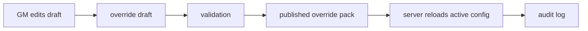

# GM Dashboard Design

## Purpose

The GM Dashboard controls game configuration and balance. It should never directly corrupt source data. GM edits should create draft override records, validate them, then publish them.

## Dashboard Modules

| Module | Purpose |
|---|---|
| Dashboard | Server health, data warnings, recent GM actions |
| World Manager | Maps, portals, collision, zone instances |
| Monster Manager | HP, damage, XP, AI profile, linked sprite |
| Spawn Manager | Spawn tables, spawn points, respawn timers |
| Loot Manager | Drop tables, drop chances, rarity, quantities |
| Item Manager | Equipment stats, stack limits, durability |
| Shop Manager | Vendor inventory, prices, stock, restock rules |
| Skill Manager | Mana, aether, target type, formulas |
| Skill Effect Lab | Link skills to real client effect animations |
| Quest Manager | Quest steps, dialogue, objectives, rewards |
| Player Tools | Inspect, teleport, mute, flag, support actions |
| Audit Center | Broken references, missing stats, missing links |
| Publish Center | Validate and publish override packs |

## Data Flow



## Loot Manager

Fields:

```text
loot_table_id
monster_id
item_id
rarity
drop_chance
quantity_min
quantity_max
requires_quest_flag
level_range
enabled
notes
```

Rules:

- Drop rates are server-side only.
- Scraped `normal` and `rare` labels are hints, not final probabilities.
- Every published change creates a `gm_actions` row.
- Every loot table must validate item and monster references.

## Spawn Manager

Fields:

```text
map_id
monster_id
spawn_group
x
y
count
respawn_seconds
ai_profile_id
enabled
```

Rules:

- Spawns create `monster_instances`.
- Spawn tables are static configuration.
- Monster instances are live runtime state.

## Skill Effect Lab

Purpose:

Link scraped skills to real client effect animations.

Panels:

| Panel | Contents |
|---|---|
| Skill list | Path, level, spell type, target, mana, aether |
| Skill detail | Description, requirements, scraped icon as clue |
| Client effect browser | 648 real client effects |
| Preview stage | Caster, target, trap, area preview |
| Link editor | Role, timing offset, confidence, status |

Important:

```text
Final skill animation must always use client effect data.
Scrape spell GIF is only a visual clue.
```

## Quest Manager

Quest Manager is required because quests are server-managed state.

Controls:

- Quest definition.
- Quest steps.
- NPC dialogue.
- Requirements.
- Rewards.
- Repeatability.
- Cooldowns.
- Test/simulate as player.
- Broken reference audit.

Quest objective types:

```text
talk
collect
kill
visit
craft
education
escort
choice
```

## Publish Center

Before publishing, validate:

- No broken monster/item/map/skill references.
- No negative drop rates.
- Drop chance totals are sane.
- Quest steps are reachable.
- Rewards reference valid items/skills.
- Skills have valid target modes.
- Kids-restricted content obeys account policy.
- Diamond rewards are requests to ArgantaLabs, not local diamond grants.

