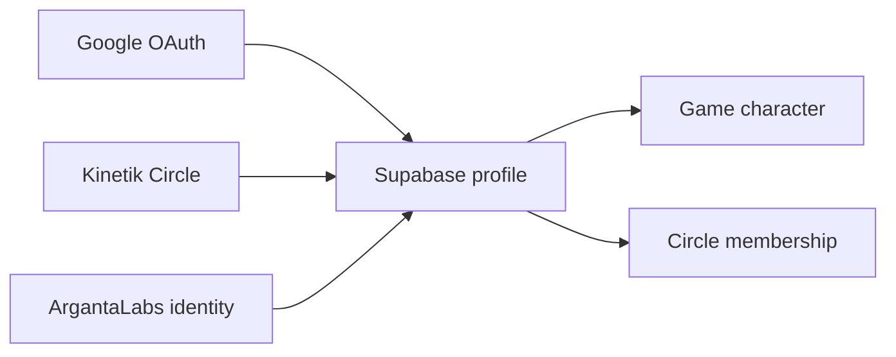
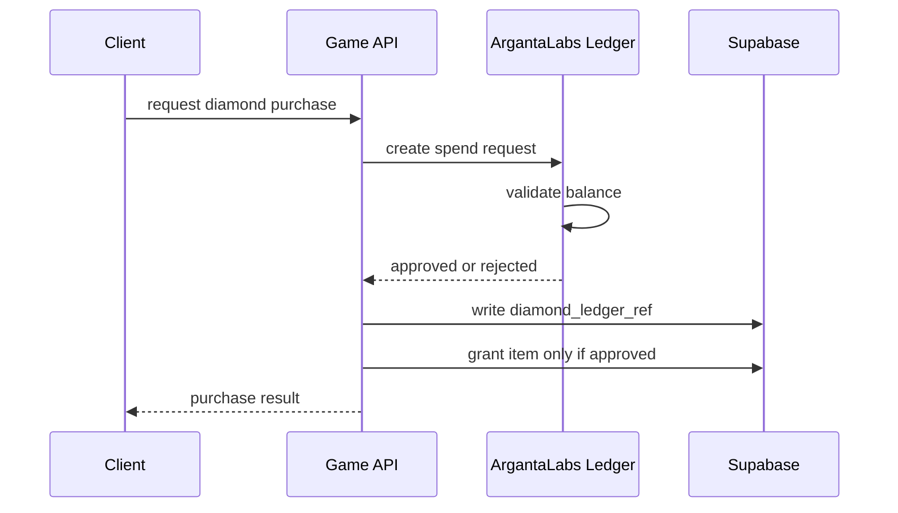

# Identity, EXP, Diamonds, And Ledgers

## Identity Model

There are four important account types:

| Account Type | Login Source | Purpose |
|---|---|---|
| Adult | Google OAuth | Normal game account |
| Kid | Kinetik Circle kids account | Education-led game account |
| Guardian | Google OAuth + Kinetik Circle | Parent/teacher/guardian controls |
| GM/Admin | Google OAuth + role | Admin and operations |

## Identity Graph



## EXP Model

There are two separate EXP lines.

| User Type | EXP Source | Ranking Source |
|---|---|---|
| Adult | Game server | Monster EXP only |
| Kid | ArgantaLabs education ledger | Education EXP only |

## Adult EXP Rules

Adults can receive:

- Monster EXP.
- Quest EXP.
- Milestone EXP.
- GM adjustment EXP.

Adult monster ranking only uses:

```text
monster_exp_ledger.amount
```

## Kid EXP Rules

Kids can receive:

- Education quest EXP from ArgantaLabs.
- Education milestone EXP from ArgantaLabs if approved.

Kids cannot receive:

- Monster EXP.
- Combat progression EXP.
- Local game-created education EXP.

Hard validation:

```text
if account_type = kid and exp_source = monster:
  reject

if account_type = kid and source is not ArgantaLabs education event:
  reject progression EXP
```

## Diamond Rules

Diamonds have one source of truth:

```text
ArgantaLabs Diamond Ledger
```

Supabase may store:

- Mirrored balance.
- Ledger references.
- Last synced event.
- Spend request status.

Supabase may not:

- Invent diamond balance.
- Locally adjust diamond balance without ArgantaLabs event.
- Let GM directly add diamonds.

## Diamond Spend Flow



## Milestones

Adult milestones:

- Reach level 99.
- Earn 1M monster EXP.
- Complete path quest.
- Kill boss.
- Obtain rare drop.
- Join clan.

Kid milestones:

- Complete first education quest.
- Complete 10 math quests.
- Complete reading streak.
- Reach education level 10.
- Finish circle assignment.
- Earn learning badge.

Shared milestones:

- Create first character.
- Customize avatar.
- Join circle or family.
- Attend event.
- Unlock cosmetic.

## Ledger Principle

Every progression event must be append-only.

```text
Do not mutate totals without ledger rows.
Totals are derived from ledger rows.
```

