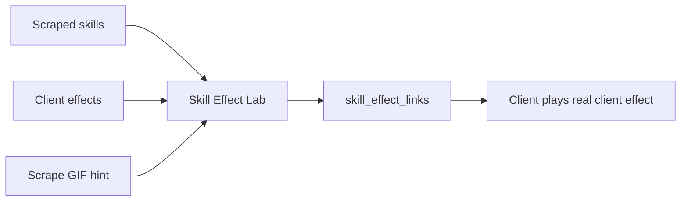
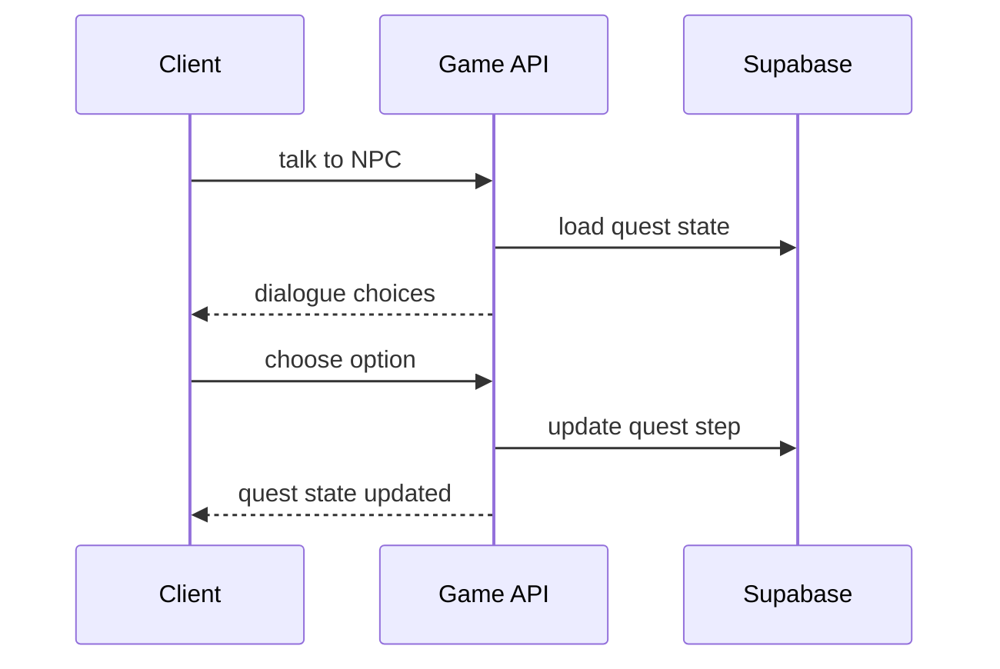
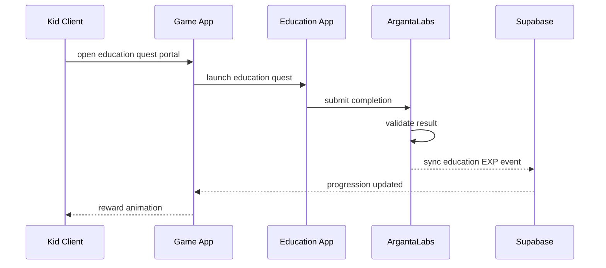

# Skill Effects And Quest Manager

## Skill Effect Correlation

Final skill animations must come from the decoded NexusTK client assets.

Scraped spell GIFs are useful only as visual hints. They should not be the final runtime animation source.

## Skill Effect Sources

| Source | Provides |
|---|---|
| Scrape skills | Name, path, level, mana, aether, duration, target, requirements |
| Client effects | Real animation frames, delays, alpha, palette data |
| Scrape spell GIFs | Visual clue only |

## Skill Link Model

One skill can have multiple effect roles:

| Role | Meaning |
|---|---|
| `cast` | Effect on caster |
| `projectile` | Traveling effect |
| `impact` | Effect on target |
| `aura` | Persistent buff/debuff visual |
| `trap` | Ground/tile trap |
| `area` | Multi-target area effect |
| `self` | Self-only effect |

## Skill Effect Lab Flow



## Skill Effect Review UI

Panels:

- Skill list by path.
- Skill detail.
- Requirement list.
- Client effect browser.
- Preview stage.
- Link editor.
- Confidence/status panel.

Statuses:

```text
auto_candidate
manual_review
confirmed
rejected
needs_better_match
```

## Quest Manager

Quest Manager is required because quests are server-side logic.

Quests control:

- NPC dialogue.
- Requirements.
- Quest flags.
- Step progression.
- Item checks.
- Monster kill checks.
- Map visit checks.
- Education quest completion checks.
- Rewards.
- Repeatability.
- Cooldowns.
- Skill unlocks.

## Quest Objective Types

```text
talk
collect
kill
visit
craft
education
escort
choice
```

## Adult Quest Flow



## Kids Education Quest Flow



## Quest GM Dashboard

Required screens:

- Quest list.
- Quest editor.
- Step editor.
- Dialogue editor.
- Requirement editor.
- Reward editor.
- Simulation panel.
- Broken reference audit.
- Publish validation.

Important rule:

```text
Kids education quest completion must be validated by ArgantaLabs.
The game may display and celebrate the reward, but it must not invent kids education EXP.
```

