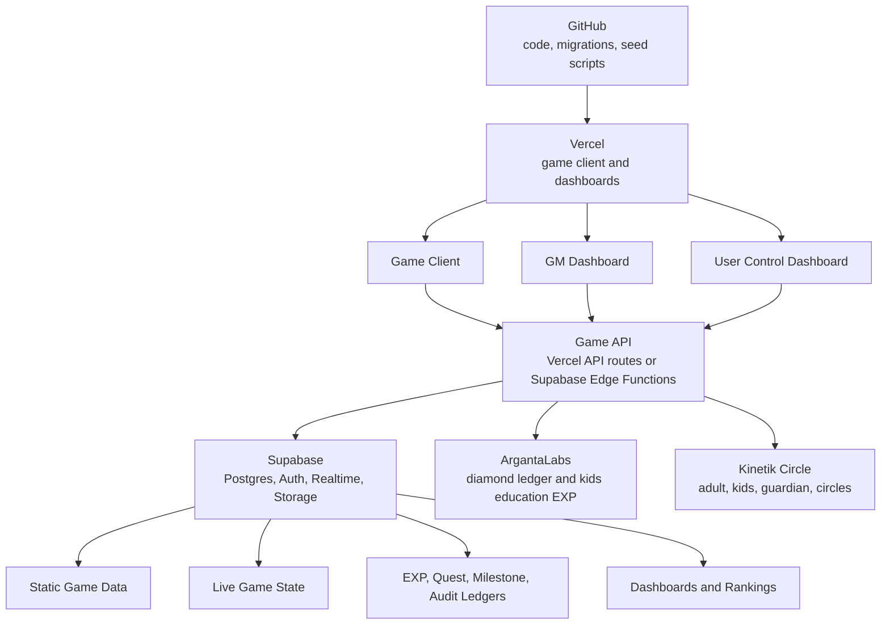
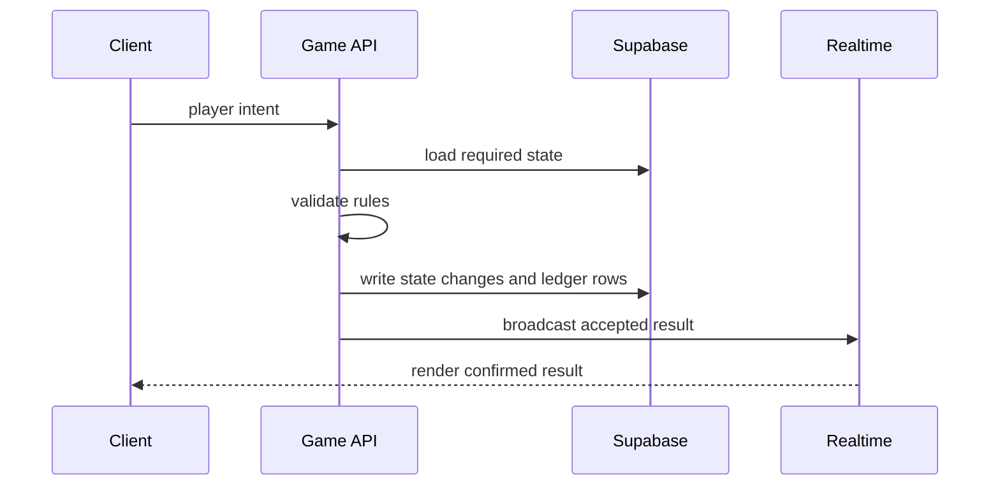

# MMORPG System Architecture

## Goal

Build a real MMORPG-style game using:

- Supabase for database, auth, realtime, storage, and server-side functions.
- Vercel for the game client, GM dashboard, and user control dashboard.
- GitHub for code, migrations, seed scripts, and deployment history.
- ArgantaLabs for the diamond ledger and kids education EXP ledger.
- Kinetik Circle for adult, guardian, kids, and circle identity.

## Main System Map



## Current Source Layers

| Layer | Current Location | Purpose |
|---|---|---|
| Scraped/core data | `apps/kingdom/data/core` | Maps, monsters, items, drops, shops, skills, appearances |
| Client data | `apps/kingdom/data/client` | Sprites, palettes, animations, effects, UI, tiles, audio |
| Links | `apps/kingdom/data/links` | Joins scraped records to client assets |
| Overrides | `apps/kingdom/data/overrides` | Hand-tuned game truth |
| Derived | `apps/kingdom/data/derived` | Generated audit and build output |

## Future Runtime Layers

```text
source_data -> canonical_game_data -> balance_overrides -> live_state
```

| Layer | Meaning |
|---|---|
| `source_data` | Raw imported scrape and client metadata |
| `canonical_game_data` | Cleaned static game records used by the server |
| `balance_overrides` | Tuned HP, damage, drop rates, spawn rules, item stats |
| `live_state` | Characters, sessions, monster instances, inventory, quest progress |

## Server Side Vs Client Side

| System | Server Owns | Client Owns |
|---|---|---|
| Character | position, path, level, stats, inventory | paper-doll rendering, UI input |
| Movement | validation, collision, portals, map instance | animation and camera |
| Combat | hit/miss, damage, HP, cooldowns, death | attack animation and damage display |
| Monsters | spawn, AI, HP, aggro, death, respawn | monster animation playback |
| Skills | mana, aether, formulas, target validation | visual effect playback |
| Drops | loot roll, ownership, ground item creation | drop icon render |
| Quests | flags, dialogue state, objectives, rewards | dialogue UI |
| Shops | price, stock, transaction validation | shop UI |
| Diamonds | ArgantaLabs only | display balance only |
| Kids education EXP | ArgantaLabs only | display progress only |

## Authoritative Flow



## Core Rule

The client sends intent. The server validates and commits. The client renders the result.

