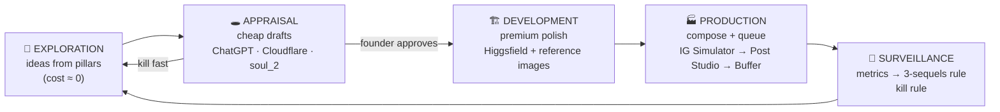

# Arganta Content OS — the Field Development Plan for content

> The founder is a reservoir geologist, so the content machine runs on the mental
> model he already thinks in. **Ideas are prospects. Drafts are appraisal wells.
> Premium generation is development drilling. Publishing is production. Analytics
> is surveillance.** You never drill a development well on an unappraised prospect,
> and you never spend Higgsfield credits on an unapproved draft.
>
> Persona canon: `knowledge-base/brand/arganta-creator-handoff.md` (+ Biography
> Studio twin `publicRules`). Arganta = the founder's REAL digital twin. Launch
> Arganta alone; the fictional four stay paused.

---

## 1 · The mental model



**The one law:** money and time only flow rightward after a human gate. Kill at
appraisal costs nothing; kill at development costs credits; kill at production
costs audience trust. So be brutal early and generous late.

## 2 · The generation ladder (premium plan)

Tiered exactly like the four-tier LLM router — every asset starts at the lowest
tier that can prove the idea, and climbs only on approval.

| Tier | Tool | Cost | Use for | Never for |
|---|---|---|---|---|
| **T0 · Manual** | ChatGPT / Gemini images, dropped by hand | subscription you already pay | Composition ideas, scene exploration, mood tests | Final posts |
| **T1 · Cheap auto** | Cloudflare worker image gen · Higgsfield `soul_2` (~1 cr) | pennies | Volume drafts, background plates, style tests | Identity-critical faces |
| **T2 · Premium polish** | Higgsfield `nano_banana_pro` (2 cr, **multi-reference**) | credits | FINALS: approved draft as composition ref + employer-safe real photos as identity ref, combined in one polish pass | Unapproved concepts |
| **T3 · Motion** | Higgsfield video models (image-to-video) | most expensive | Reels/Shorts hero shots — ONLY animated from approved T2 stills | Anything unproven |

**The reference-image chain (why this beats prompting from scratch):**
`real face photos (identity anchor)` + `approved draft (composition anchor)` →
nano_banana_pro → final. Identity can't drift because it's pinned to the real
photos; composition can't drift because it's pinned to the approved draft.

**Intake convention** — one folder, three stages, so any tool and any Claude
session knows where things stand:

```
apps/hq/public/influencer/arganta/
  drafts/     ← T0/T1 output lands here (founder drops ChatGPT images manually)
  approved/   ← founder moves keepers here = the ONLY trigger for T2 spend
  final/      ← T2/T3 output; the only folder content may publish from
```

Filenames carry intent: `<pillar>-<format>-<slug>.png` (e.g. `core-reel-agents-disagree.png`).

## 3 · Format masters — shoot once, cut everywhere

Every piece of content is born as ONE master, then derived per platform. Never
produce per-platform from scratch.

| Master | Spec | Derives to | Produced by |
|---|---|---|---|
| **Vertical video** | 9:16 · 1080×1920 · hook ≤0.8s · 20–35s | IG Reel · TikTok · YT Short (same file, platform-native caption + cover each) | Video Builder (MP4 export) / T3 Higgsfield clips |
| **Square/portrait still** | 4:5 · 1080×1350 | IG feed · LinkedIn · X | Post Studio canvas over T2 final |
| **Carousel** | 4:5 × 3–7 slides | IG carousel · LinkedIn doc post | Post Studio (Arganta brand base) |
| **Story frame** | 9:16 still + text | IG Story (daily ritual) · TikTok story | IG Simulator ritual + Post Studio |
| **Long video** (later) | 16:9 · 3–8 min | YouTube · repurposed into 3 Shorts | Video Builder v2 — not yet |

**Derivation rules per platform** (the only things that change):
- **IG Reel** — polished cover frame, caption from pillar voice, 3–5 hashtags, publish via Buffer queue.
- **TikTok** — same master, rawer caption (more spoken, no hashtags wall), native text overlay allowed to differ.
- **YT Shorts** — same master, TITLE is the hook (searchable phrasing), end-card asks a question.
- **LinkedIn** — carousel/still + first-person professional retelling (the executive bio voice).
- **X** — the hook line as text + still; thread for journey chapters.

One plan item in the simulator = one master + a platform checklist, not five separate plans.

## 4 · The pillar → format map (what to make, forever reusable)

| Pillar (canon) | Weight | Best formats | Standing franchises |
|---|---|---|---|
| **Arganta Core** | 25% | Reel (screen + face), carousel breakdown | This Should Not Work · One Person Company |
| **Journey** | 20% | Carousel chapters, X threads, monthly Reel | The Journey (2010→now, one chapter each) |
| **Digital Evolution** | 15% | Carousel, before/after Reel | scripts→dashboards→ML→agents artifacts |
| **Subsurface Intelligence** | 15% | Carousel, explainer Reel | "Geologists read rocks…" lessons |
| **Founder After Hours** | 15% | Story-first, occasional honest Reel | 2:13 a.m. Failure Report |
| **Operator Discipline** | 10% | Stories, Sat still | training/recovery beats — discipline, never display |

**Hook formula stays** (0–0.8s visual anomaly → promise → escalate → payoff → open
loop) and the **surveillance rules stay**: a format earns 3 sequels when it doubles
share-rate or follow-conversion or >70% completion; a format dies after 5
well-packaged attempts with no follows/retention/comments.

## 5 · The weekly operating rhythm (who does what)

| Day | Founder (15–30 min/day) | Claude session | Machine (auto) |
|---|---|---|---|
| **Sun** | Approve next week's plan + drafts folder review → move keepers to `approved/` | Draft the week: batch-JSON into IG Simulator, write captions/hooks per platform | reconcile loop flips sent→posted |
| **Mon–Fri** | Shoot 1 real B-roll clip/day (phone, command room) · approve queue in Buffer | T2 polish runs on newly-approved drafts · compose in Post Studio · send to Buffer queue | Buffer publishes on schedule |
| **Sat** | Operator Discipline shoot + family day | Cut next week's derivations from masters | — |
| **Sun** | 10-min metrics review (saves/follows/completion per post) | Apply 3-sequels/kill rules to next plan | — |

Founder total: ~2–3 hrs/week. Everything else is Claude + pipeline.

## 6 · Launch sequence (canon milestone: 9 posts + 5 highlights before anything else)

The nine foundational posts, each tagged with generation tier:

1. **WHO I AM** — Reel, the 15-years line over real workspace B-roll *(T3 from T2 still, or real footage)* → pin
2. **THE MENTAL MODEL** — carousel, geology→agentic-AI ladder *(Post Studio only, zero gen)* → pin
3. **ARGANTA CORE, LIVE** — Reel, real screens, one command *(real capture + T2 cover)* → pin
4. **Journey Ch.1: Indonesia 2010** — carousel *(T0 archival-style draft → T2)*
5. **This Should Not Work #1** — Reel, first Core experiment *(real screens)*
6. **Subsurface Intelligence #1** — carousel, "reading invisible worlds" *(T1 plates → T2)*
7. **Founder After Hours #1** — honest still + long caption *(real photo)*
8. **The Failure Report #1** — Reel *(real capture)*
9. **Operator Discipline #1** — Sat still *(real photo, employer-safe)*

Five highlight sequences: JOURNEY (posts 4+…), BUILDS (5,8), CORE (3,5), OPERATOR (9 + stories), BTS (7 + stories). All nine get planned in the IG Simulator first, previewed in the phone, then run the pipe.

**Hard blocker (founder-only): the employer-safe portrait/B-roll set** — current real photos carry NOC branding. Until then, T2 identity polish has no clean anchor.

## 7 · AI Influencer Studio — polish roadmap (to support all of the above)

| Phase | What | Why | Executor |
|---|---|---|---|
| **A1** | **Platform matrix on plan items** — `platforms: ('ig'|'tiktok'|'yt'|'li'|'x')[]` + per-platform caption fields + checklist chips in composer; master/derivative link | One master → many outlets, tracked in one place | Sonnet |
| **A2** | **Asset Pipeline panel** — drafts/approved/final folder board inside the studio (scan `public/influencer/arganta/*`), attach any asset to a plan item; approve = file move | Makes the T0→T2 gate visible and one-click | Opus (UI) |
| **A3** | **Polish seam** — "Polish with Higgsfield" button on an approved asset: builds the reference-chain request (identity refs + draft) via media-core/MCP; writes result to `final/` | Removes the manual Higgsfield round-trip | Sonnet, after A2 |
| **A4** | **Surveillance tab** — manual-entry per-post metrics (saves, follows, completion) + the 3-sequels/kill verdicts rendered on franchises | Closes the loop; keeps decisions honest | Sonnet |
| **A5** | **Ritual → Story composer** — one-click render of the day's ritual frames to 9:16 story PNGs (accent gradient text-story style already proven in the phone) → drafts | Daily stories become a 2-minute task | Opus |
| Deferred | TikTok/YT direct publish (Buffer covers IG; others manual-post from `final/` until volume justifies APIs) | Don't build integrations before the habit exists | — |

Spec updates owed: `ai-influencer-studio-spec.md` still describes the fictional
Arganta — rewrite §personas after A1.

## 8 · Standing prompts (reusable capsules)

- **T0 draft prompt (ChatGPT/any LLM):** "Photorealistic concept frame for an Instagram {format} in the pillar '{pillar}': {scene}. Southeast-Asian male founder, late 30s, short black hair, groomed short beard, in a real multi-screen command room (ultrawide, laptops, cables — working room, not showroom). Cinematic warm-gold on charcoal. Composition study only — face likeness NOT required."
- **T2 polish prompt (Higgsfield nano_banana_pro, with refs attached):** "Use reference image 1–2 as the exact same person (identity). Match the composition, framing and mood of reference image 3 (the approved draft). Photorealistic, cinematic warm-gold on charcoal, 85mm shallow depth. No employer logos or branded lanyards anywhere, no fabricated data presented as real, no text artifacts."
- **Caption voice:** first person, confident expert + honest beginner-founder; one open loop per caption; never "I left geology for AI"; the system is always **Arganta Core**.
