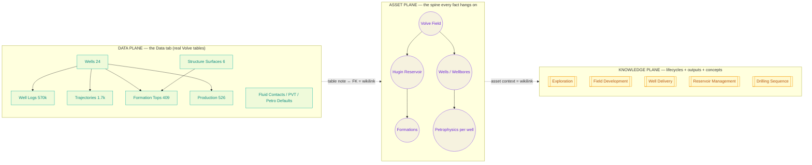
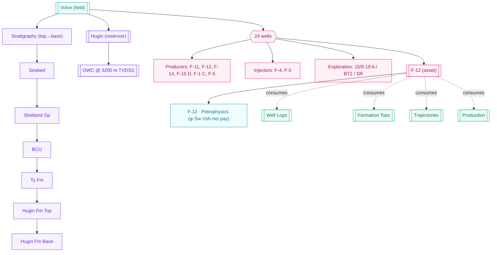
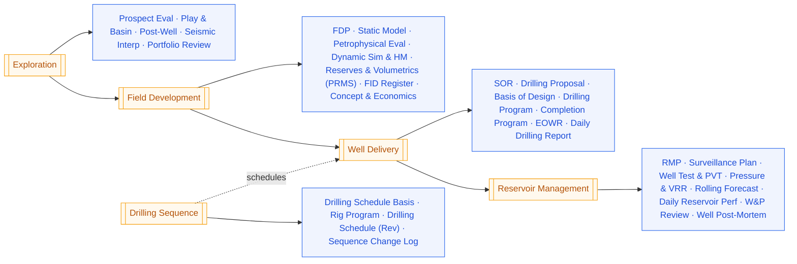
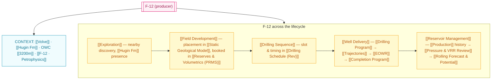

# ArgantaEnergy Knowledge Base — Ontology & Context Map

> **Intent.** A **CDF-style connected twin** (Cognite-Data-Fusion analogy): one graph where
> *actual data* and *knowledge* are the **same fabric**. Every **well** is a first-class
> **asset** that is fully **contextualized** to its **field → formation → petrophysics**, and
> then followed through **all five lifecycle workstreams** — Exploration → Field Development →
> Well Delivery → Reservoir Management → Drilling Sequence — with **every output deliverable**
> hung off the well it describes. Wikilinks are the wiring. Nothing is fabricated; every node
> is either a real Volve data entity or a defined knowledge/workstream artifact.

This document **maps it all** — concept only. It is the spec the future Knowledge tab (Explorer +
Graph) will be generated from. It reuses the Manager tab's 5-lifecycle taxonomy and hangs the
data model (the Data tab) onto it.

---

## 0. The three planes + the bridge

The KB is one graph over three planes. The **bridge** is what makes it CDF-like: a data table and
its knowledge note are two faces of one entity, and a foreign key **is** a wikilink.



- **Data plane** — the 9 Volve tables already modeled in the Data tab (`volve-model.ts`). Real rows.
- **Asset plane** — the *spine*: Field → Reservoir → Formation → Well → Wellbore → Petrophysics.
  Every data row and every knowledge note resolves to a node on this spine (CDF's "asset" concept).
- **Knowledge plane** — the 5 lifecycle workstreams, their child folders, their **outputs**, plus
  cross-cutting **concepts** and **decisions**.
- **Bridge rule (the CDF move):** each **data table → one datatable-note**; each **foreign key →
  a wikilink** to the target's note. So `Well Logs.Well → Wells.Well` becomes
  `[[Well Logs]]` links `[[Wells]]`. Clicking a value in the Data tab jumps to its note; a note's
  backlinks show every table and workstream that touches it.

---

## 1. Node taxonomy (graph node / note types)

Nine node types (the graph legend). Color = graph node color; every note carries a
`type` in frontmatter.

| Type | Color | What it is | Folder | Example nodes |
|---|---|---|---|---|
| `field` | teal `#0FB5A6` | the asset root | `01_Field` | [[Volve]] |
| `formation` | violet `#7c3aed` | reservoir / strat unit | `02_Formations` | [[Hugin Fm]] · [[Ty Fm]] · [[BCU]] |
| `well` | pink `#e11d74` | wellbore asset (the spine) | `03_Wells` | [[F-12]] · [[F-4]] · [[15/9-19 A]] |
| `petrophysics` | cyan `#22d3ee` | per-well interpreted rock/fluid | `04_Petrophysics` | [[F-12 · Petrophysics]] |
| `datatable` | green `#10b981` | a Data-tab table (the bridge) | `05_Data` | [[Well Logs]] · [[Production]] |
| `lifecycle` | amber `#f59e0b` | a workstream | `06_Lifecycles` | [[Field Development]] |
| `output` | blue `#2563eb` | a deliverable produced by a lifecycle | `07_Outputs` | [[FDP]] · [[EOWR]] |
| `concept` | slate `#64748b` | doctrine / method / standard | `08_Concepts` | [[Evidence-native]] · [[PRMS]] |
| `decision` | red `#dc2626` | a logged decision / ADR | `09_Decisions` | [[ADR — OWC at 3200m]] |

Edges are typed (see §6): `contextualizes · consumes · produces · evidences · supersedes · relates`.

---

## 2. Vault folder taxonomy (flat, type-prefixed — Obsidian/ASKB style)

```
00_Home/            → the map-of-content (this ontology, dashboards, entry points)
01_Field/           → Volve (root asset note)
02_Formations/      → Hugin Fm Top, Hugin Fm Base, BCU, Ty Fm, Shetland Gp, Seabed (+ Reservoir: Hugin)
03_Wells/           → 24 well notes (F-1…F-15 + sidetracks + 15/9-19 exploration)
04_Petrophysics/    → per-well petrophysical summary notes (φ, Sw, Vsh, net pay, contacts)
05_Data/            → 9 datatable notes (the Data-tab bridge) + Log Coverage, Data Quality
06_Lifecycles/      → 5 workstream notes + their child-folder index notes
07_Outputs/         → every deliverable note (grouped by lifecycle, mirrors the Manager tab)
08_Concepts/        → doctrine/method/standards (PRMS, VRR, Archie, evidence-native, provenance)
09_Decisions/       → logged decisions / ADRs (contact picks, FID, sequence changes)
```

Auto-generated notes carry `#auto`; hand-authored carry `#curated`. Regeneration never clobbers
`#curated` bodies (only refreshes the auto data blocks).

---

## 3. The asset spine — every well contextualized

The spine is the CDF asset hierarchy for Volve. **This is the "strong context" the founder asked
for**: a well is never a bare row — it resolves up to field/formation and down to petrophysics, and
sideways to every workstream that touched it.



**Every `well` note (auto-generated) contains, as wikilinks:**
- **Field / reservoir:** `part of [[Volve]] · reservoir [[Hugin Fm]]`
- **Formation picks:** the ordered tops this well penetrates → `[[Hugin Fm Top]]`, `[[BCU]]`, …
  (from **Formation Tops** table, 409 picks).
- **Petrophysics:** `→ [[F-12 · Petrophysics]]` (curves present: GR·RHOB·NPHI·RT·PHIE·SWE·VSH).
- **Role & dynamics:** producer/injector/exploration; if production exists → `[[Production]]` history.
- **Data coverage:** which of the 9 tables have rows for this well (the Data-tab Quality matrix, per well).
- **Lifecycle journey:** links to every stage's output about this well (see §5 worked example).

---

## 4. The 5 lifecycles + children + **outputs** (the Manager tab, mapped)

Each lifecycle is a `lifecycle` note. Its **child folders** (Manager tab `FOLDERS`) become sub-index
notes. Its **outputs** (Manager corpus — standards `.md` + generated deliverables) become `output`
notes, each wikilinking to the wells/formations/data it is built from and the decisions it feeds.



### 4.1 Exploration — *find & assess*
- **Child folders:** Prospect Evaluations · Play & Basin · Post-Well · Reviews
- **Outputs:** [[Exploration Well Report]] · [[Appraisal Well Report]] · [[Prospect Evaluation]] ·
  [[Play & Basin Assessment]] · [[Seismic Interpretation]] · [[Exploration Portfolio Review]]
- **Data consumed:** [[Structure Surfaces]] · [[Well Logs]] (exploration wells 15/9-19) · [[Formation Tops]]
- **Produces context on:** [[Hugin Fm]] presence/quality, discovery wells, leads.
- **Feeds:** Field Development.

### 4.2 Field Development — *model & plan*  (the built lifecycle today)
- **Child folders:** FDP · Concept Select · Reserves & Volumetrics · Economics
- **Outputs:** [[Field Development Plan (FDP)]] · [[Static Geological Model]] ·
  [[Petrophysical Evaluation]] · [[Dynamic Simulation & History Match]] ·
  [[Reserves & Volumetrics (PRMS)]] · [[FID Future Wells Register]] · [[Concept Select & Economics]]
- **Data consumed:** [[Structure Surfaces]] · [[Formation Tops]] · [[Well Logs]] · [[Fluid Contacts]]
  (OWC 3200) · [[PVT]] (Bo 1.47 · Rs 148) · [[Petro Defaults]]
- **Produces context on:** [[Hugin Fm]] volumetrics, well placement, [[Volve]] concept & economics.
- **Feeds:** Well Delivery (well proposals) + Drilling Sequence (schedule basis).

### 4.3 Well Delivery — *drill & complete*
- **Child folders:** Well Plans · Daily Drilling · Final Well Reports · Post-Mortems
- **Outputs:** [[Statement of Requirements (SOR)]] · [[Drilling Proposal]] · [[Basis of Design (BOD)]] ·
  [[Drilling Program]] · [[Completion Program]] · [[End of Well Report (EOWR)]] · [[Daily Drilling Report]]
- **Data consumed:** [[Wells]] · [[Trajectories]] (1,694 stations) · [[Formation Tops]] (landing)
- **Produces context on:** as-drilled wellbores, completions, lessons per well.
- **Feeds:** Reservoir Management (as-built wells).

### 4.4 Reservoir Management — *operate & optimize*
- **Child folders:** Daily Production · Surveillance · W&P Reviews · Forecasts
- **Outputs:** [[Reservoir Management Plan (RMP)]] · [[Reservoir Surveillance Plan]] ·
  [[Well Test & PVT]] · [[Pressure & VRR Review]] · [[Rolling Forecast & Potential]] ·
  [[Daily Reservoir Performance]] · [[Well & Pattern Review]] · [[Well Post-Mortem]]
- **Data consumed:** [[Production]] (526 well-months + 112 field) · [[Well Logs]] · [[Fluid Contacts]] · [[PVT]]
- **Produces context on:** production/injection performance, VRR balance, forecasts, opportunities.
- **Feeds:** Drilling Sequence (infill candidates) + back into Field Development (history match).

### 4.5 Drilling Sequence — *schedule & sequence*
- **Child folders:** Schedule Revisions · Rig Programs · Sequence Changes · Milestones
- **Outputs:** [[Drilling Schedule Basis]] · [[Rig Program]] · [[Drilling Schedule (Rev)]] · [[Sequence Change Log]]
- **Data consumed:** [[Wells]] (planned/FID) · [[FID Future Wells Register]]
- **Produces context on:** rig-by-time plan, sequence changes, milestones.
- **Feeds:** Well Delivery (what to drill next).

---

## 5. The **well journey** — worked example: **F-12** (producer)

The founder's "strong context" test: one well, threaded through **every** lifecycle, with data on one
side and outputs on the other. Every bracket is a real wikilink target.



**F-12 note (auto) — link inventory:**
`part of [[Volve]] · reservoir [[Hugin Fm]] · penetrates [[Hugin Fm Top]], [[BCU]], [[Ty Fm]] ·
petrophysics [[F-12 · Petrophysics]] · data [[Well Logs]] [[Trajectories]] [[Formation Tops]]
[[Production]] · delivered by [[Drilling Program]] → [[EOWR]] · managed in [[Pressure & VRR Review]]
[[Rolling Forecast & Potential]] · scheduled in [[Drilling Schedule (Rev)]]`

Opening F-12's **backlinks** answers, in one view: *what rock is it in, what data exists, who drilled
it, how it's performing, and every document that mentions it.* That is the CDF contextualization.

---

## 6. Data ↔ Knowledge bridge (the wiring rules)

**Edge/relationship grammar** (typed wikilinks; the graph colors edges by type):

| Edge | From → To | Source of truth |
|---|---|---|
| `contextualizes` | Well → Field / Formation | Asset spine (§3) |
| `consumes` | Lifecycle / Output → Data table | §4 data-consumed lists |
| `produces` | Lifecycle → Output | Manager corpus (§4) |
| `evidences` | Output → Data table / Well | citation in the note body |
| `covers` | Data table → Well | FK `*.Well → Wells.Well` |
| `supersedes` | Output vN → vN-1 | version frontmatter |
| `decides` | Decision → Well / Contact / Output | ADR links |

**Auto-generation (keeps KB in sync with data — mirrors the reference's `waBuildKnowledge`):**
1. **Field note** ← index (field, CRS, datum, totals).
2. **Formation notes** ← `Structure Surfaces` (6) + reservoir = Hugin; each links [[Volve]] and its picks.
3. **Well notes** ← `Wells` (24); each links field/reservoir/formation-picks/petrophysics + data coverage.
4. **Petrophysics notes** ← `Well Logs` curve availability per well (φ·Sw·Vsh present).
5. **Datatable notes** ← the 9 Data-tab tables; **each FK becomes a wikilink** (the bridge) + row count.
6. **Lifecycle + Output notes** ← Manager `FOLDERS` + corpus; outputs link the wells/data they cite.
7. **Recompute links** → backlinks + local graph per node.

Only `#auto` blocks refresh; `#curated` prose and `09_Decisions` are preserved.

---

## 7. Graph views (Explorer + Graph & Timeline) — later build

The Knowledge tab (future) has two sub-tabs, reusing the reference's shapes but rebranded + Volve:
- **Explorer** — folder tree (§2) + note center (rendered markdown w/ wikilinks) + right context
  (backlinks + local graph). Search across notes & tags.
- **Graph & Timeline** — the force-directed knowledge graph. Layout modes:
  **Galaxy** (global), **Atomic** (one node + neighbors), **Neurons** (dense clusters),
  **Constellation** (by type), **Rings** (by folder), **Spiral** (by time / version). "Living"
  physics toggle. Color by node type (§1); filter by type/lifecycle/well.

---

## 8. What this concept commits to

1. **One graph, three planes, one bridge** — data and knowledge are the same fabric; FK = wikilink.
2. **Well = asset spine** — every well contextualized to field · formation · petrophysics · all 5 lifecycles.
3. **Manager tab is the knowledge skeleton** — the 5 lifecycles + child folders + every output are notes.
4. **Grounded 1:1 in Volve** — real wells (24), formations (Hugin/Ty/Shetland/BCU), OWC 3200, PVT, production; no Al Shaheen / Cosmo / vendor-agent identity.
5. **Auto-synced, evidence-native** — notes regenerate from the Data tab; every claim cites its table.

> **Next (on approval):** turn this map into the seed data model (`knowledge-model.ts`) — the note
> generators + link graph — then build the Knowledge tab (Explorer + Graph) on it, in the ArgantaEnergy
> design system. No build until this ontology is signed off.
