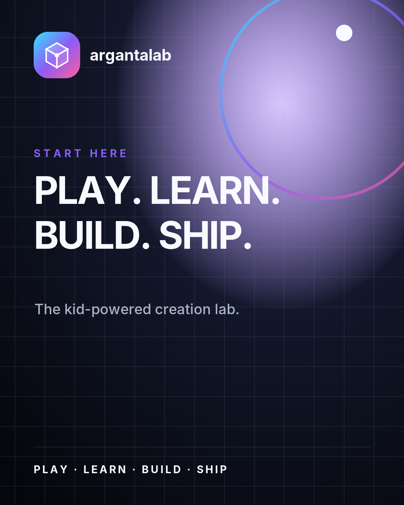
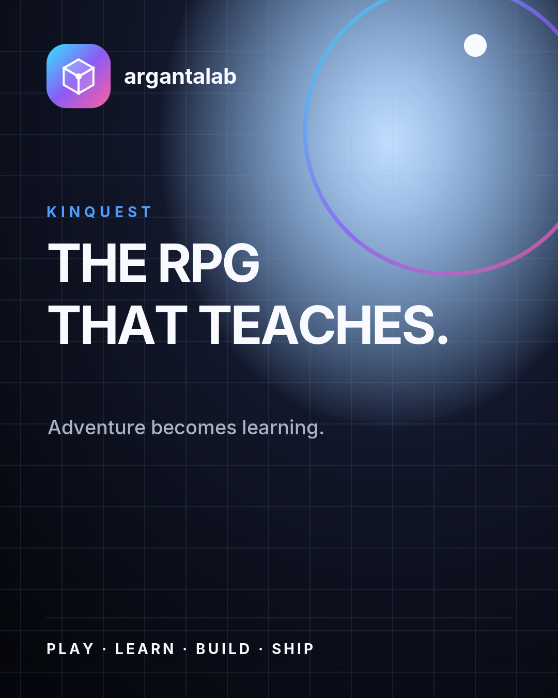
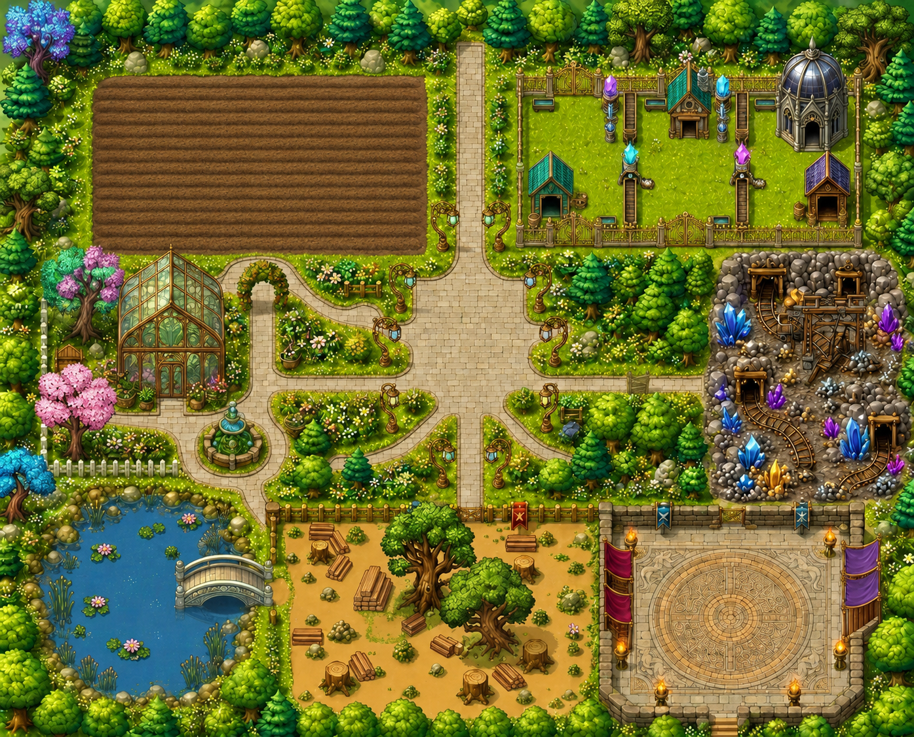

# Visual Evidence Register

## What survives

**FACT:** The repositories contain abundant game art and UI code, but very few conventional, date-stamped screenshots of the products. Most historical UI evidence is executable HTML/React/CSS at a commit, not a PNG capture.

That distinction matters:

1. **Existing image evidence** can be shown directly and attributed to the commit that added it.
2. **Reconstructed capture** must be rendered from a specific historical commit and labeled as a reconstruction.
3. **Current UI** must not be used to illustrate an earlier milestone unless the frame explicitly says it is the current descendant.

## Existing image evidence

| Artifact | First evidenced commit | What it proves | Current status | Public-use note |
|---|---:|---|---|---|
| `packages/brand/brands/argantalab/refs/cover-start-here.png` | `95352172` (2026-07-16) | The canonized ArgantaLab brand used a dark grid, gradient planetary form, cube mark, and “PLAY. LEARN. BUILD. SHIP.” language. | Exists on `main` | Brand reference; confirm whether it was published or only used internally. |
| `packages/brand/brands/argantalab/refs/cover-kinquest.png` | `95352172` | The Brand OS reference explicitly positioned KinQuest as “THE RPG THAT TEACHES.” | Exists on `main` | Treat as a brand reference, not evidence of campaign performance. |
| `packages/brand/brands/argantalab/refs/cover-build-log.png` | `95352172` | A build-in-public content format was part of the recorded brand system. | Exists on `main` | Does not prove the post was published. |
| `packages/brand/brands/argantalab/refs/profile-dark.png` | `95352172` | Records a dark profile/avatar treatment for ArgantaLab. | Exists on `main` | Confirm final public account usage. |
| `apps/web/public/assets/roguelike/sheet.png` | `05793862` (2026-07-01) | KinQuest shipped with an authored sprite-sheet asset, not only descriptive product copy. | Exists on `main` | Safe as repository art after ownership is confirmed. |
| `apps/lashira/web/public/farm-art/basemap.png` | `cf9d2efa` (2026-07-08), later revisions | The Lashira direction included a bright top-down farm/castle/mines/forest world map. | Exists on `main` | Attribute the displayed revision to its exact commit. |
| Hand-quality Lashira basemap | `91721578` | A separate art-library branch tested another basemap treatment. | Unmerged branch only | Label “unmerged experiment”; do not call it production art. |

## Embedded repository images

These are live references to the current files. Their captions state only what the files themselves establish.

### ArgantaLab brand reference

**FACT:** Added with the Brand OS commit `95352172` on 2026-07-16.

### KinQuest brand reference

**FACT:** Present in the same canonized ArgantaLab reference set.

### Lashira basemap

**FACT:** The first basemap file appears in `cf9d2efa` on 2026-07-08 and is revised by later commits. The image above is the current `main` version, not necessarily the first revision.

## Historical UI that can be reconstructed

| Date | Commit | Surface to render | Visual contrast to capture | Evidence files |
|---|---:|---|---|---|
| 2026-06-12 | `fbe65ef` | Standalone Kinetik repository | World Cup forecast arena before Kinetik | `index.html` |
| 2026-06-12 | `5f77dd3` | Kinetik shell | Today/Calendar/Ask/Apps/Me and “Plans. People. Play.” | `index.html`, icons, manifest |
| 2026-06-12 | `7d17369` | Kinetik shell | Moments replacing Ask; assistant becoming an orb | `index.html` |
| 2026-06-13 | `cf21f97` | Kinetik Moments | Stories, feed, creation, and real media handling | `index.html` |
| 2026-06-13 | `7dcaf5d` | Kinetik Apps | Circle Chat and manifest-driven app registry | `index.html`, registry/catalog files |
| 2026-06-20 | `34385b3` | ArgantaLab static prototype | Strike Zone-era root experience | root HTML/CSS/JS files at commit |
| 2026-06-20 | `6a4e798` | First React app | Static-to-React visual migration | `apps/web` at commit |
| 2026-06-20 | `f2c00fd` | Web Quest | Eight-lesson path and 3D world map | Web Quest pages/components |
| 2026-06-20 | `8765ff9` | Learning worlds | Space, Neural, and Prompt Forge | world and forge components |
| 2026-06-20 | `02e5452` | Game Wizard | Guided generation replacing generic Studio | Wizard and generated-game views |
| 2026-06-20 | `bc27845` | Discover/My GameStore | First visible creator marketplace loop | Discover, MyGameStore, PlayPage |
| 2026-06-21 | `7cb10f2` | Six worlds | NumberDash through LifeQuest | WorldHub/world modules and concept snapshots |
| 2026-06-21 | `c4bf1fc` | Buddy | Companion and streak loop | Buddy and PlayHome |
| 2026-06-21 | `99ca81f` | Parent/Journey | Child journey, quests, parent surface | Journey, Quests, Parent |
| 2026-06-23 | `7fb6e6c` | Rebuilt Kinetik | Clean Supabase-backed rebuild | `apps/kinetik` at commit |
| 2026-06-23 | `e6713c9` | KinetikCircle | First rebranded shell | Kinetik app shell/brand assets |
| 2026-06-23 | `fdccc1b` | Family Pulse | Parent analytics reframed as a family product | HQ/parent analytics files |
| 2026-06-25 | `e31f886` | Moments/Open World | Family-media and spatial-world modules together | Kinetik Moments, open-world modules |
| 2026-06-26 | `c63d902` | Broadcast | Discover-like feed replacing HQ Moments | Broadcast route/components |
| 2026-06-27 | `9af806e` | Arganta landing | First umbrella-brand explanation | `apps/landing` |
| 2026-07-01 | `05793862` | KinQuest | Flagship RPG surface and sprite art | KinQuest components/data/sheet |
| 2026-07-02 | `4b3f914` | The Bridge | MCP/control-plane architecture made visible | `apps/mcp` and HQ surfaces |
| 2026-07-03 | `70fc13f` | Studio v2 | Genre modules and reusable game engine | Studio engine/modules |
| 2026-07-14 | `2424798` | Media Center | Shared media layer and UI | media package/surface |
| 2026-07-16 | `95352172` | Brand OS | Product visuals consolidated into a brand contract | `packages/brand` |
| 2026-07-17 | `14e529d` | Forge | Chat-driven app/game builder | Forge routes/components |

## Recommended reconstruction protocol

For every documentary screenshot:

1. Create a temporary read-only worktree at the exact commit.
2. Record repository, full commit hash, capture date, route, viewport, and any seed data used.
3. Run locally with network calls disabled unless the historical surface cannot render otherwise.
4. Replace or blur names, email addresses, family data, tokens, project URLs, and private endpoints.
5. Add a visible caption: “Reconstructed from commit `<hash>` dated `<date>`.”
6. Never silently repair the old UI for the screenshot. If a compatibility patch is required, preserve it separately and disclose it.
7. Capture both the full screen and two detail crops so Reel, carousel, and YouTube editors share one evidentiary source.

## Suggested before/after sequences

### Sequence A — A repository changes identity

1. `fbe65ef`: World Cup predictor.
2. `5f77dd3`: Kinetik family shell.
3. `7d17369`: Moments earns the navigation slot.
4. `e6713c9` in ArgantaLab: KinetikCircle identity.

### Sequence B — Prototype to learning universe

1. `34385b3`: static Strike Zone root.
2. `6a4e798`: React migration.
3. `f2c00fd`: cinematic Web Quest.
4. `7cb10f2`: six-world system.
5. `05793862`: KinQuest flagship RPG.

### Sequence C — Tool to creator platform

1. `02e5452`: Game Wizard.
2. `6a6973a`: Builder Lab.
3. `bc27845`: Discover and My GameStore.
4. `70fc13f`: reusable Studio v2 engine.
5. `14e529d`: conversational Forge.

### Sequence D — Products converge

1. `5defdd0`: cloud progress and Diamonds.
2. `5ba1158`: cloud circles and family identity.
3. `952676e`: canonical identity/family/wallet spine.
4. `c72af75`: shared combat package.
5. `95352172`: shared Brand OS.

## Visual gaps requiring founder input

- Original design files or screenshots from before the first surviving Kinetik family-shell commit.
- Proof of which historical builds were publicly deployed versus only committed.
- Phone captures of Kinetik/KinetikCircle at the time of the June 23 rebuild.
- Any dated screenshots of real founder use that can be safely redacted.
- Confirmation that repository seed names and family examples are fictional before they appear on screen.
- Ownership/licensing status for sprite sheets, game art, fonts, and Brand OS reference images.

## Visual claims to avoid

- Do not call a repository asset a screenshot unless it is one.
- Do not show the current application while narrating an old commit without a “current descendant” label.
- Do not imply branch-only art shipped.
- Do not use a generated mockup as historical evidence.
- Do not infer users, adoption, revenue, or production release from polished UI.
