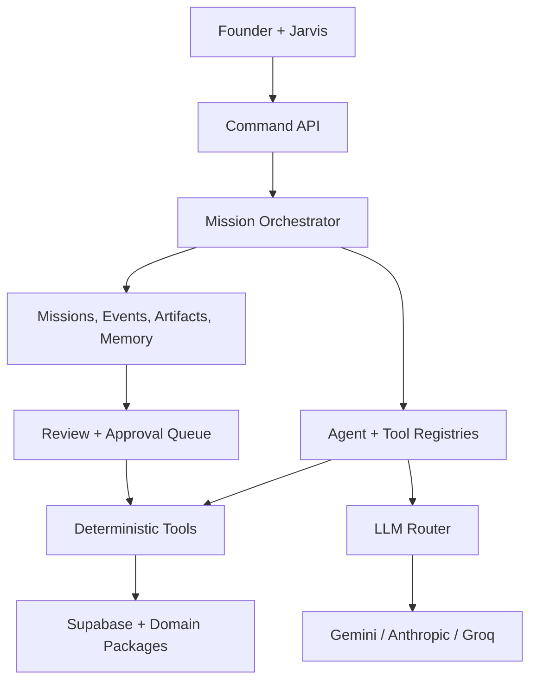
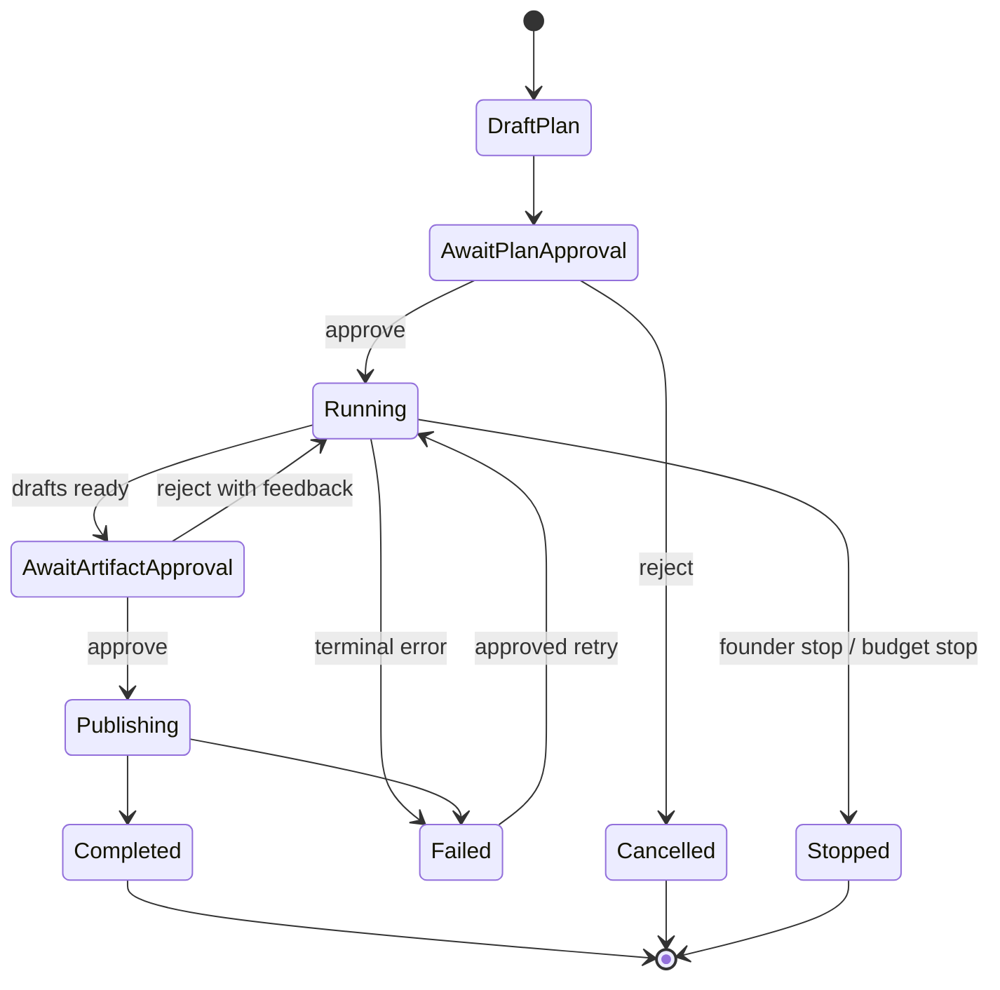

# Circle HQ — Real Agentic Command Center PRD

## 0. Executive decision

Circle HQ will become a governed operating system in which every left-rail surface is an **Agent Room** with real data, real tools, a measurable deliverable, persistent memory, and an explicit autonomy level.

The company metaphor becomes an enforceable architecture:

| Metaphor | Product component | Enforceable meaning |
|---|---|---|
| Jarvis CEO Orb is the **face** | CEO interaction layer | The founder can ask, inspect, approve, interrupt, and redirect from any surface |
| Command is the **brain** | Mission control and governance | Plans, delegates, monitors, escalates, synthesizes, and records decisions |
| Data is **working memory** | Operational data plane | Live product, business, schema, telemetry, and agent-run state |
| Vault is **long-term memory** | Curated knowledge plane | Canonical documents, decisions, evidence, and approved learned lessons |
| Portfolio and Growth are **sensors** | Observation plane | Detect portfolio health, behavior changes, anomalies, opportunities, and blind spots |
| Architecture is the **skeleton** | Constraint and dependency plane | Shows how products, data, services, costs, risks, and agents connect |
| Builders are the **hands** | Governed action plane | Produce reviewable game, app, learning, content, battle, character, world, music, video, pixel, and agent artifacts |
| Supabase is the **nervous system** | Shared state and event spine | Authenticated ingestion, persistence, realtime updates, policies, and audit history |

The product promise is not "AI employees chatting in a dashboard." It is:

> A founder directive becomes a bounded mission; agents inspect evidence and use real builder capabilities; drafts and verdicts arrive with provenance; the founder approves consequential actions; outcomes are measured; the operating system remembers what was learned.

### Decisions that this PRD makes

1. Keep Fable's unified registry, tool-pack seam, mission runner, review queue, persistence, and approval model.
2. Keep every current rail surface. Do not collapse Builder agents into persona prompts.
3. Separate **capability** from **autonomy**. Every room can be agentable while remaining manual or assistive.
4. Instrument product events before allowing agents to claim live insight.
5. Use a deterministic state machine for orchestration first; retain portability to LangGraph or another engine later.
6. Use Gemini 2.5 Flash/Flash-Lite for cheap routine work, Claude Sonnet 5 for high-judgment work, and Groq as an operational fallback. Reserve Claude Fable 5 for founder-invoked deep strategy only.
7. Store actual provider, model, tokens, latency, and estimated cost on every model call. Remove fictional UI model labels and hardcoded `$2.20/month` economics.
8. Start production proof with two golden missions: one business loop and one builder loop. Expand all Builders through the same contracts after those pass.

---

## 1. Context and current-state audit

This PRD is based on `main` at commit `4b688536f2b773f58c60a84295abd8174bb9e774` and Fable's `docs/agent-os-v2-grand-design.md`.

### What already exists and should be reused

- `apps/hq`: React/Vite/TypeScript founder control plane with CEO Orb, Portfolio, Growth, Data, Vault, Architecture, Command, and eleven Builder surfaces.
- Six Command offices: Bridge/CEO, COO, CTO, CFO, GC, and CAPO.
- A 27-role typed roster and deterministic `Sense → Compute → Match → Generate → Deliver` flow.
- `packages/ai`: provider-neutral chat, structured JSON, tools, streaming, routing, and graceful fallback.
- Live Supabase access and RPCs for portfolio, growth, retention, acquisition, economy, schema, content, activity, games, and Kinetik statistics.
- Deterministic product graph, verdict rules, scale and finance models, provenance states, and a read-only MCP bridge.
- Real domain packages and Builder engines: `packages/video`, `packages/audio`, `packages/combat`, `packages/character`, `packages/heroes-engine`, and working HQ authoring surfaces.
- A canonical Markdown knowledge base generated into the HQ Vault.

### What is still simulation, theater, or disconnected

- Agent tools are read-only. No agent can use a Builder engine to create a governed artifact.
- Orchestration animations do not affect execution; Council responses and token economics are hardcoded.
- Runs, missions, artifacts, consults, approvals, conversations, and model usage are not durably recorded.
- Vault is not used as grounded retrieval; edits remain local and are not an agent memory system.
- `hq_event` exists, but important product event producers and blind signals are not fully wired.
- Command verdict resolution is local rather than a shared operational ledger.
- The MCP server and in-app runtime can drift because they do not share a tool registry.
- Runtime model badges do not necessarily match the provider/model that answered.
- The current tool loop is shallow, single-agent, non-delegating, and non-resumable.

### Baseline truth that must remain visible

- Current architecture coverage is approximately **78%: 59 of 76 nodes live**.
- Tier-1 blind signals include `sig.dead_end_quit`, `sig.build_abandoned`, `sig.broken_share_link`, `sig.calendar_open_no_add`, `sig.ugc_flagged`, `arganta.home`, `ship.discover`, `land.home`, `land.products`, `land.pitch`, and `sig.deck_no_waitlist`.
- CAC `$75`, conversion `2%`, and infrastructure `$0.08` are simulated assumptions, not live measurements.

No agent may restate simulated values as live facts.

---

## 2. Product definition

### 2.1 Vision

Circle HQ is the founder's real-time, governed command center for running Arganta as an AI-native company.

### 2.2 Primary user

The initial user is the founder/operator. Later users may include trusted executives or collaborators, but multi-user organizational workflows are not required for the first trusted release.

### 2.3 Jobs to be done

The founder needs to:

1. See what is true across the portfolio and how fresh/reliable each fact is.
2. Ask Jarvis a business or production question and receive an evidence-backed answer.
3. Turn a directive into an editable, costed, bounded mission.
4. Watch agents work through real tools rather than simulated dialogue.
5. Review and approve drafts or consequential actions from one queue.
6. Interrupt, retry, reject, or redirect any mission.
7. Know which model, tools, data, knowledge, time, and money produced every result.
8. Measure whether an approved action improved the target signal.
9. Grant or revoke limited autonomy without changing an agent's capability.

### 2.4 Goals

- Every rail room implements a common Agent Room contract.
- At least two end-to-end missions operate over real sources and tools.
- Every model call and tool call has provenance and an append-only audit event.
- No side-effecting action occurs outside the approval and policy system.
- Mission state survives refresh, restart, timeout, and provider failure.
- HQ displays actual rather than branded model economics.
- Approved feedback and outcomes become retrievable memory.

### 2.5 Non-goals for v2.1

- Fully autonomous company operation.
- Arbitrary recursive agent delegation.
- Browser/computer-use agents controlling third-party applications.
- A vector database before deterministic search quality proves insufficient.
- Exposing write-capable tools through MCP.
- Self-modifying production prompts or AgentSpecs without review.
- Training or fine-tuning a proprietary model.
- Treating role-play personas as independently running agents.

### 2.6 Success metrics

| Metric | Trusted MVP target | Full v2.1 target |
|---|---:|---:|
| Golden missions completing without manual database repair | ≥ 90% over 20 runs | ≥ 95% over 100 runs |
| Claims with a source envelope | 100% | 100% |
| Model/tool calls recorded in run ledger | 100% | 100% |
| Unauthorized side effects | 0 | 0 |
| Publish actions with idempotency key | 100% | 100% |
| Missions resumable after page refresh | 100% | 100% |
| Agent artifacts accepted with minor/no edits | ≥ 60% | ≥ 75% per agent before autonomy increases |
| Unlabeled simulated financial/product values | 0 | 0 |
| Tier-1 blind signals wired | first 5 | all 11 listed above |
| Monthly model spend variance from ledger | within 20% of projection | within 10% |

---

## 3. Product experience: every rail item becomes an Agent Room

An Agent Room is a surface plus a capability contract. It does not have to call an LLM on every visit.

### 3.1 Common room contract

Each room must expose:

1. **Observe** — live/simulated source cards, freshness, confidence, and blind spots.
2. **Ask** — scoped Jarvis/room-agent conversation with citations.
3. **Mission** — suggested or founder-authored goal with a plan preview.
4. **Work** — deterministic and model steps shown as a live timeline.
5. **Deliverables** — artifacts, verdicts, or decisions awaiting review.
6. **Memory** — relevant decisions, approved lessons, prior runs, and feedback.
7. **Controls** — mode, budget, schedule, triggers, tool permissions, and stop button.

### 3.2 Agent modes

| Mode | Behavior | Default approval |
|---|---|---|
| Manual | Agent is available but never starts work itself | Founder initiates every run and action |
| Assist | Agent suggests insights, plans, and drafts | Founder initiates; every side effect approved |
| Delegate | Agent may execute an approved mission plan | Drafts can be automatic; publish/spend remains approved |
| Autopilot | Agent may run on bounded triggers within a grant | Only risk classes explicitly allowed by the grant |

Default for every agent is **Assist**. Autopilot is not a Boolean inside `AgentSpec`; it is a revocable, scoped, expiring grant in operational data.

### 3.3 Jarvis interaction model

- The CEO Orb remains the face across the application.
- On the home surface, the left rail may collapse to an "Agent Spine" rather than disappear, preserving spatial awareness.
- Opening the Orb passes the active surface, selected entities, current filters, and visible source cards as context references—not a raw DOM dump.
- Jarvis distinguishes: **answer**, **propose mission**, **request approval**, **status**, and **stop**.
- A model never directly interprets a click as authorization for an unrelated action.

---

## 4. Target system architecture



### 4.1 Components

#### A. `packages/agentos` — portable execution kernel

```text
packages/agentos/
  src/
    types.ts              # agent, tool, mission, run, event, artifact, grant
    agentRegistry.ts      # framework-neutral agent definitions
    toolRegistry.ts       # zod-validated allowlisted tools
    orchestrator.ts       # deterministic mission state machine
    runLoop.ts            # bounded model/tool turn loop
    policies.ts           # risk, budget, approval, GC and permission checks
    provenance.ts         # common source/evidence envelope
    costing.ts            # token and tool cost calculation
    memory.ts             # retrieval contracts and feedback projection
    artifacts.ts          # draft/review/publish state machine
    index.ts
```

Rules:

- No React imports and no `apps/*` imports.
- Domain behavior enters only through registered tools and persistence adapters.
- Orchestrator state is serializable so another engine can replace it later.
- Tool arguments and results are schema-validated.
- The package never possesses provider keys or a Supabase service-role key.

#### B. `apps/hq/src/agentos` — HQ composition

```text
apps/hq/src/agentos/
  registry.ts
  personas.ts
  missionClient.ts
  sourceRegistry.ts
  artifactRenderers.tsx
  toolpacks/
    command.ts
    portfolio.ts
    growth.ts
    data.ts
    knowledge.ts
    architecture.ts
    pixel.ts
    game.ts
    app.ts
    learn.ts
    agents.ts
    content.ts
    battle.ts
    character.ts
    world.ts
    music.ts
    video.ts
```

The browser only receives read-safe tools and calls server endpoints for privileged execution.

#### C. Supabase Edge Functions — trusted control boundary

| Function | Responsibility |
|---|---|
| `event-ingest` | Authenticate product events, validate schema, add server timestamps and provenance, write idempotently |
| `agent-run` | Start/resume/cancel a mission or child run, enforce grants and budgets, invoke providers and server tools |
| `agent-tick` | Claim due schedules/signals and enqueue bounded missions with concurrency locks |
| `agent-action` | Execute approved publish/spend/destructive tools with idempotency and audit events |
| `llm-proxy` | Provider abstraction, actual model metadata, usage capture, timeout/retry policy |

Provider credentials and service-role credentials remain server-side.

#### D. `packages/ai` — model gateway

Extend rather than rewrite it:

- Add a native Anthropic Messages provider; Anthropic is not treated as OpenAI-compatible.
- Update Gemini production configuration from Gemini 2.0 Flash to an approved stable 2.5 model.
- Retain Groq's OpenAI-compatible provider as a fallback.
- Return `{provider, model, usage, latencyMs, finishReason, requestId}` for every call.
- Add maximum input/output tokens, timeout, one retry, and budget class to every route.
- Keep mock and deterministic fallback for local/offline operation.
- Keep WebLLM off for the trusted MVP; its download, device, and maintenance complexity does not yet repay the benefit.

#### E. MCP bridge

- Import read tools from the same shared tool packs.
- Keep MCP read-only during v2.1.
- Never expose service credentials or write actions through the initial MCP surface.
- If write-enabled MCP is introduced later, require separate scopes, per-action approval, and short-lived tokens.

---

## 5. Data sources, knowledge sources, and memory

### 5.1 Four-layer memory model

| Layer | Purpose | Canonical store | Write rule |
|---|---|---|---|
| Operational memory | Current product and business truth | Supabase product tables, RPCs, `hq_event`, `learn_event`, telemetry | Product/server producers and validated tools |
| Episodic memory | What agents did and what happened | Missions, runs, events, tool calls, artifacts, feedback, outcomes | Append-only runtime events plus state projections |
| Semantic memory | Durable approved company knowledge | `knowledge-base/**/*.md`, repo docs, ontology, approved decision records | Human approval or reviewed knowledge proposal |
| Working memory | Context for one mission | Reconstructed from mission references, tool results, and retrieval | Ephemeral/cache; never treated as durable truth |

Raw chat transcripts do not automatically become knowledge. A Knowledge Agent may propose a concise lesson or decision record; the founder approves it before it enters canonical semantic memory.

### 5.2 Source registry

| Source | Access method | Used by | Freshness / trust rule |
|---|---|---|---|
| Portfolio, growth, retention, acquisition, economy RPCs | Deterministic Supabase RPC | Portfolio, Growth, COO, Jarvis | Include RPC name, query time, and live/partial/simulated provenance |
| Schema model, schema insight, table preview, migrations | Supabase RPC and migration metadata | Data, Architecture, CTO | Read-only; no schema mutation from a model |
| Games, apps, broadcasts, artifacts, circles | Existing `live.ts` services and server tools | Builder agents, Portfolio | Writes become draft or approved actions |
| `hq_event`, `learn_event`, artifact telemetry | Validated server ingestion | Data, Growth, Portfolio, CAPO | Event ID + producer + occurred/received timestamps; deduplicate |
| Knowledge base Markdown | Generated deterministic index | Knowledge, all agents | Canonical path, content hash, last update, citation span |
| HQ Vault user notes | New persisted Vault table/export workflow | Knowledge, Jarvis | Private by default; only approved notes are broadly retrievable |
| Product ontology and Architecture graph | Shared pure model plus live overlays | Architecture, all chiefs | Node provenance retained; blind nodes never promoted to live |
| Agent run ledger | Supabase projections over append-only events | Command, CAPO, CFO | Actual provider/model/token/cost only |
| Founder decisions and artifact feedback | Decision and artifact records | All agents | Must reference the relevant mission/artifact and actor |
| Financial assumptions | Versioned assumption records | CFO, Jarvis | Explicit `simulated` or `modeled`; effective date and author required |

### 5.3 Required source envelope

```ts
interface SourceRef {
  id: string;
  kind: 'rpc' | 'table' | 'event' | 'kb' | 'repo' | 'model' | 'assumption' | 'tool';
  locator: string;
  capturedAt: string;
  occurredAt?: string;
  freshness?: 'live' | 'recent' | 'stale' | 'unknown';
  provenance: 'live' | 'partial' | 'simulated' | 'placeholder' | 'derived';
  confidence?: number;
  contentHash?: string;
  citation?: { start?: number; end?: number; label: string };
}
```

Every factual claim in a delivered artifact links to one or more `SourceRef`s. Confidence must be absent unless it is computed by a defined rule; the UI must not invent percentages.

### 5.4 Retrieval strategy

1. Apply deterministic metadata and permission filters.
2. Use exact identifiers and structured queries when possible.
3. Use keyword/full-text retrieval over Markdown and persisted notes.
4. Return source snippets and metadata to the model; require citation IDs in structured output.
5. Add embeddings/pgvector only if the corpus or measured retrieval failure justifies it.
6. If hybrid retrieval is added, store embedding model/version and never let similarity score masquerade as truth confidence.

The current knowledge base is small enough that deterministic indexing should be the first implementation.

### 5.5 Event instrumentation priority

Before agents act on these paths, implement or verify producers for:

1. `sig.dead_end_quit`
2. `sig.broken_share_link`
3. `sig.calendar_open_no_add`
4. `sig.ugc_flagged`
5. `sig.build_abandoned` through a server-side inactivity sweep
6. surface-view events for `arganta.home`, `ship.discover`, `land.home`, `land.products`, and `land.pitch`
7. `sig.deck_no_waitlist`

Event schemas live in a shared package. Client code never writes directly with service-role privileges.

---

## 6. Deterministic logic, API calls, and LLM boundaries

### 6.1 Decision rule

Use the least probabilistic mechanism that can complete the job:

| Job | Mechanism | Why |
|---|---|---|
| Fetch/query/filter/count/aggregate | SQL, RPC, pure TypeScript | Reproducible and cheap |
| Validate schemas, permissions, states, budgets | Zod, SQL constraints, policy code | Safety boundary must be deterministic |
| Detect known thresholds or blind signals | Rule engine | Explainable verdicts |
| Simulate battles, compose from recipe parameters, render projects | Existing domain package | The Builder engine is the capability |
| Retrieve exact knowledge | Full-text/metadata search | Source-grounded and inexpensive |
| Decompose a novel directive | LLM structured JSON | Judgment over ambiguous intent |
| Select among allowlisted tools | Tool-capable LLM under a step cap | Flexible but bounded |
| Draft prose, storyboards, item stems, specs | LLM plus deterministic validation | Creative transformation |
| Compliance on explicit rules | Deterministic policy | Reliable hard gate |
| Ambiguous policy classification | Cheap LLM, then GC/founder escalation | Model can advise, not silently authorize |
| Publish, spend, delete, migrate, permission change | Deterministic API after policy/approval | Consequential side effect |
| Remember a lesson | Draft summary + human approval + deterministic write | Prevent memory poisoning |

### 6.2 Tool contract

```ts
interface AgentTool<I, O> {
  id: string;
  version: string;
  description: string;
  inputSchema: ZodType<I>;
  outputSchema: ZodType<O>;
  kind: 'sense' | 'compute' | 'draft' | 'publish' | 'admin';
  risk: 'R0' | 'R1' | 'R2' | 'R3';
  permissions: string[];
  timeoutMs: number;
  estimatedCost?: CostEstimate;
  execute(ctx: ToolContext, input: I): Promise<ToolResult<O>>;
}

interface ToolResult<O> {
  ok: boolean;
  data?: O;
  error?: { code: string; retryable: boolean; message: string };
  sources: SourceRef[];
  actualCostUsd?: number;
  idempotencyKey?: string;
}
```

### 6.3 Risk classes

| Risk | Examples | Default policy |
|---|---|---|
| R0 — observe | Query RPC, retrieve KB, run local simulation | Allowed in an approved/initiated mission |
| R1 — draft | Create unpublished post, project, spec, verdict proposal | Allowed in Assist/Delegate; visible in Review Queue |
| R2 — publish/reversible | Publish content, enable feature/config, send parent-facing artifact | Explicit founder approval unless a narrow active grant permits it |
| R3 — high impact | Spend money, delete data, change permissions, schema migration, bulk publish | Explicit approval every time; second confirmation for destructive actions |

An autonomy grant specifies `agentId`, tool IDs or risk ceiling, target scope, maximum calls/cost, schedule/trigger, start, expiry, and revocation. R3 cannot be permanently granted in v2.1.

---

## 7. Model selection and routing

Pricing below uses public provider prices available on 2026-07-13. Provider pricing can change; the runtime pricing registry must be versioned by effective date.

### 7.1 Recommended model policy

| Route | Production model | Use | Fallback |
|---|---|---|---|
| `deterministic` | none | Queries, rules, validation, builders, policy, publishing | Honest error/empty state |
| `micro` | Gemini 2.5 Flash-Lite | Classification, extraction, title/label, GC precheck | Groq GPT OSS 20B |
| `standard` | Gemini 2.5 Flash | Routine tool selection, briefs, drafts, summaries | Groq GPT OSS 120B, then deterministic template |
| `deep` | Claude Sonnet 5 | Mission planning, architecture, ambiguous trade-offs, high-quality learning/spec work | Gemini 2.5 Pro, then require founder retry |
| `premium` | Claude Fable 5 | Explicit founder deep-strategy or difficult architecture/coding session | Claude Sonnet 5 |

Notes:

- Use the paid Gemini tier for production data handling rather than the free tier.
- Migrate/verify Google API authentication before the September 2026 standard-key rejection deadline.
- Do not use a preview model as the default production dependency.
- Prompts send retrieved evidence and compact tool results, not the entire database or repository.
- Premium routing is never automatic.

### 7.2 Cost profiles

| Profile | Token assumption per model turn | Model | Estimated cost/turn |
|---|---:|---|---:|
| Micro | 2,000 input + 500 output | Gemini 2.5 Flash-Lite at $0.10/M in, $0.40/M out | $0.00040 |
| Standard | 6,000 input + 1,500 output | Gemini 2.5 Flash at $0.30/M in, $2.50/M out | $0.00555 |
| Deep — introductory | 12,000 input + 3,000 output | Claude Sonnet 5 at $2/M in, $10/M out through 2026-08-31 | $0.05400 |
| Deep — regular | 12,000 input + 3,000 output | Claude Sonnet 5 at $3/M in, $15/M out from 2026-09-01 | $0.08100 |
| Premium | 12,000 input + 3,000 output | Claude Fable 5 at $10/M in, $50/M out | $0.27000 |

Prompt caching and batch pricing can lower costs, but the operating budget should not rely on discounts until the ledger proves them.

### 7.3 Per-agent baseline model budget

The table is a planning baseline for approximately **343 model turns/month**. Deterministic tool calls are not charged as model turns. Costs exclude Supabase, image generation, TTS, third-party media generation, storage, and compute rendering.

| Agent | Baseline turns/month | Default route mix | Est. model cost through Aug | Est. model cost from Sep |
|---|---:|---|---:|---:|
| Jarvis / CEO | 16 standard + 8 deep | Standard chat; deep planning/synthesis | $0.52 | $0.74 |
| COO Chief | 20 standard | Daily/weekly business synthesis | $0.11 | $0.11 |
| CTO Chief | 10 standard + 2 deep | Technical triage; deep change review | $0.16 | $0.22 |
| CFO Chief | 12 standard | Explain deterministic models | $0.07 | $0.07 |
| GC Gate | 40 micro + 4 standard | Rule/classification first | $0.04 | $0.04 |
| CAPO | 12 standard | Run-quality and ROI synthesis | $0.07 | $0.07 |
| Portfolio Agent | 12 standard | Portfolio narrative over RPCs | $0.07 | $0.07 |
| Growth Agent | 16 standard | Funnel diagnosis and experiment briefs | $0.09 | $0.09 |
| Data Agent | 30 micro + 8 standard | Data-quality classification and report | $0.06 | $0.06 |
| Knowledge Agent | 24 standard | Cited retrieval synthesis | $0.13 | $0.13 |
| Architecture Agent | 8 standard + 4 deep | Coverage report; deep ADR | $0.26 | $0.37 |
| Pixel Agent | 8 standard | Generation/spec assistance | $0.04 | $0.04 |
| Game Agent | 6 standard + 2 deep | Game spec and complex design | $0.14 | $0.20 |
| App Agent | 6 standard + 2 deep | App config and complex spec | $0.14 | $0.20 |
| Learn Agent | 10 standard + 4 deep | Item batches and high-quality review | $0.27 | $0.38 |
| Agent Builder / Smith | 6 standard + 3 deep | Charter/tool/policy design | $0.20 | $0.28 |
| Content Agent | 24 standard | Multiplatform drafts | $0.13 | $0.13 |
| Battle Agent | 8 standard | Explain deterministic tuning | $0.04 | $0.04 |
| Character Agent | 8 standard | Character/skill drafts | $0.04 | $0.04 |
| Openworld Agent | 6 standard + 2 deep | Map patch and world plan | $0.14 | $0.20 |
| Music Agent | 8 standard | Recipe/parameter generation | $0.04 | $0.04 |
| Video Agent | 12 standard + 2 deep | Storyboard and complex direction | $0.17 | $0.23 |
| **Baseline total** | **343 turns** | Premium mode excluded | **≈ $2.95** | **≈ $3.73** |

Recommended initial model budget: **$10/month alert, $20/month hard stop**. The difference above the baseline covers retries, larger contexts, provider variance, and iteration. External generation tools receive separate budgets and ledger categories.

### 7.4 Cost enforcement

- Estimate mission cost before the founder approves its plan.
- Apply per-run output caps and maximum model turns.
- Log estimates and actuals per call, agent, mission, provider, and tool.
- Stop before exceeding a hard budget and ask for approval to continue.
- CAPO reports accepted-artifact cost and retry/rejection waste, not vanity token totals.
- CFO reports model cost separately from media generation and infrastructure.

Official pricing references:

- Anthropic: https://platform.claude.com/docs/en/about-claude/pricing
- Google Gemini API: https://ai.google.dev/gemini-api/docs/pricing
- Groq: https://groq.com/pricing

---

## 8. Agent catalog: sources, tools, model, and deliverable

### 8.1 Chiefs and governance agents

| Agent | Sources / knowledge | Deterministic tools and API calls | LLM use | Required deliverable |
|---|---|---|---|---|
| Jarvis / CEO | All source envelopes, mission history, founder decisions | `ceo_brief`, `root_cause`, registry lookup, plan validation, delegate/convene | Standard for chat; deep for novel multi-agent plans and synthesis | Editable mission plan, status narrative, final evidence-backed synthesis, approval requests |
| COO | Portfolio/growth/activity/content/family metrics, operating decisions | Growth/portfolio RPCs, signal rules, artifact status | Standard synthesis only when needed | Daily brief: changes, cause hypotheses, owner, next action, evidence |
| CTO | Schema, architecture graph, tool health, release facts, ADRs | Schema/coverage/RPC health, dependency and migration checks | Deep for architecture or high-risk trade-offs | Technical verdict or ADR with constraints and rollback |
| CFO | Cost ledger, financial model, valuation, pricing assumptions | Deterministic finance/scale/cost functions | Standard explanation; never invent inputs | Cost/ROI brief with every assumption labeled live or modeled |
| GC | Policy KB, consent/UGC/child-facing metadata | Hard policy rules, permission and consent checks, hold/release state | Micro only for ambiguous classification; escalate uncertainty | Pass, hold, or needs-founder verdict with cited rule |
| CAPO | Run events, acceptance/rejection, latency, model/tool cost | Aggregate success, retry, cost, and outcome metrics | Standard improvement synthesis | Improve/keep/pause/replace recommendation and proposed AgentSpec diff |

### 8.2 Sensor, memory, and structure rooms

| Rail room / agent | Sources / knowledge | Deterministic work | LLM work | Deliverable |
|---|---|---|---|---|
| Portfolio | Portfolio RPCs, games/apps/content, graph provenance | Rollup, scores, deltas, anomaly thresholds | Explain material change | Portfolio health brief and scoped verdict |
| Growth | Growth/retention/acquisition/activity/events, prior experiments | Funnel/cohort/beat computation and blind-signal detection | Form causal hypotheses and experiment draft | One measurable experiment with metric, segment, duration, stop rule |
| Data | Schema/RPC metadata, event coverage, freshness | Contract checks, missing producer detection, duplicates, nulls, staleness | Summarize root cause | Data-quality report, blind-signal owner, instrumentation verdict |
| HQ Vault / Knowledge | Canonical Markdown, persisted notes, decisions, approved lessons | Filter, full-text search, citation extraction, content hashes | Cited synthesis and draft knowledge note | Evidence packet or reviewable knowledge/decision record |
| Architecture | Product graph, packages, routes, services, scale/cost models, ADRs | Coverage and dependency analysis, change impact, provenance rules | Deep architecture options and trade-offs | ADR, architecture verdict, dependency/rollback plan |

### 8.3 Builder rooms

| Builder agent | Deterministic engine/tools | LLM responsibility | Draft artifact | Publish action after approval |
|---|---|---|---|---|
| Pixel | Pixel query, facets, usage, similar, generation-job API | Produce structured art brief/parameters | `pixel.generation-request` | Submit job/import approved asset |
| Game | Studio genres, game lists/scores, template and schema validators | Produce game brief/spec and content gaps | `game.spec` or config patch | Save/publish approved game version |
| App | Circle app inventory, SDK surface, templates, config validation | Produce app behavior/config spec | `app.config` | Save/activate approved config/version |
| Learn | Content matrix, item stats, curriculum validators, learn-event evidence | Draft item stems, hints, distractors, explanations; deep review for child quality | `learn.item-batch` | Import approved versioned item batch |
| Agent Builder / Smith | Agent/tool registries, schemas, CAPO feedback | Draft charter, tools, policies, eval cases | `agent.spec-change` | Merge/activate only after tests and founder approval |
| Content | Post engine, presets, list/status, scheduling validators | Draft platform-specific copy and variations | `content.post-set` | Schedule/publish approved posts |
| Battle | Combat simulator, skill matrix, resist/fairness benchmarks | Explain/tune candidate parameters within bounds | `battle.tuning-patch` | Save approved tuning version |
| Character | Character registry, heroes engine, skill forge, benchmark | Draft character concept and bounded skill configuration | `character.spec` | Save/publish approved character version |
| Openworld | Maps, tilesets, collision/inventory rules, patch schema | Draft world/map intent and patch plan | `world.map-patch` | Apply approved patch/version |
| Music | Audio composer, recipes, usage, deterministic render | Generate musical intent and recipe parameters | `music.track-project` | Render/publish approved track |
| Video | Video director, storyboard/project schemas, assets, render pipeline | Generate structured treatment/storyboard/shot text | `video.project` | Render/export approved project; external generation separately approved |

All Builder artifacts include: input brief, structured payload, previews, validation results, sources, model/tool usage, owner agent, run/mission IDs, version, and rollback or prior-version pointer where applicable.

---

## 9. Registry design

```ts
interface AgentSpec {
  id: string;
  version: string;
  name: string;
  office: 'bridge' | 'operations' | 'technology' | 'treasury' | 'legal' | 'guild';
  guild: 'chief' | 'sensor' | 'memory' | 'architecture' | 'build';
  surfaceId: string;
  charter: string;
  personaLensIds: string[];
  toolIds: string[];
  artifactKinds: string[];
  allowedRisk: Array<'R0' | 'R1' | 'R2' | 'R3'>;
  defaultMode: 'manual' | 'assist' | 'delegate';
  modelPolicy: {
    defaultRoute: 'deterministic' | 'micro' | 'standard' | 'deep';
    allowedRoutes: string[];
    maxTurns: number;
    maxInputTokens: number;
    maxOutputTokens: number;
  };
  budgets: { perRunUsd: number; perDayUsd: number; perMonthUsd: number };
  triggers: TriggerSpec[];
  slas: AgentSla[];
  evalSuiteId: string;
}
```

`AgentSpec` declares capability and limits. Schedules, live mode, and autonomy grants remain operational records so they can be changed or revoked without redeploying code.

Persona lenses such as Kid Tester, Parent Advocate, Brand Director, Investor, or Demo Director are prompt/evaluation fragments, not continuously running model loops unless they later acquire distinct tools, an owner, and a measured deliverable.

---

## 10. Persistent data model

Use append-only run events as the audit source, with projection tables for fast UI reads.

### 10.1 Core tables

| Table | Purpose |
|---|---|
| `agent_mission` | Founder directive, approved plan, state, budget, target outcome |
| `agent_run` | One CEO or child execution with agent/version/model policy |
| `agent_run_event` | Append-only timeline: planned, started, model call, tool call, artifact, approval, error, stopped, completed |
| `agent_model_call` | Provider/model/request ID/tokens/cache/latency/cost/error |
| `agent_tool_call` | Tool/version/args hash/result hash/sources/risk/cost/idempotency |
| `agent_artifact` | Typed versioned draft/review/approval/published artifact |
| `agent_verdict` | Engine or agent verdict with `ladders_to`, evidence, owner, state |
| `agent_consult` | Cross-office request and response linked to a mission/run |
| `agent_decision` | Founder/policy decision, rationale, target, actor, timestamp |
| `agent_feedback` | Artifact/run feedback and acceptance reason |
| `agent_autonomy_grant` | Scoped, expiring permission/budget/trigger grant |
| `agent_schedule` | Cron/event trigger, last/next run, enabled state, concurrency policy |
| `agent_outcome` | Target metric baseline, observation window, result, source references |
| `vault_note` | Persisted user/agent-proposed note with permission and approval state |

### 10.2 Mission state machine



### 10.3 Security and row-level access

- Founder owns missions, grants, notes, decisions, and private artifacts.
- Product event producers receive narrowly scoped ingest credentials, not general table access.
- Edge functions use service privileges only after validating caller, action, risk, grant, budget, target scope, and idempotency.
- Artifact payloads are typed; secrets and provider responses are redacted before persistence.
- Prompt-injection-like content retrieved from Vault or product data is treated as untrusted evidence, never as system instruction.
- Logs contain hashes or redacted payloads when data may be child/family sensitive.
- Retention policy for raw model requests/responses must be explicit before production.

---

## 11. Orchestration

### 11.1 Mission flow

1. Founder gives Jarvis a directive.
2. Jarvis classifies it as answer-only, single-agent task, multi-agent mission, or forbidden/high-risk request.
3. Deterministic registry lookup identifies eligible agents and tools.
4. Deep model produces a structured plan only for novel/multi-agent work.
5. Policy code validates agents, steps, dependencies, risks, and estimated cost.
6. Founder edits/approves the plan.
7. Orchestrator persists the mission and starts ready child runs, maximum three in parallel.
8. Each child may use only its registered tools, up to eight model turns, with one retry for retryable provider/tool failure.
9. Children cannot delegate. They can request a consult through the orchestrator.
10. Child-facing artifacts automatically pass deterministic GC rules and, only when ambiguous, a micro-model classification.
11. Drafts enter Review Queue. Nothing consequential publishes merely because a model requested it.
12. Jarvis synthesizes results, blockers, costs, and approval needs.
13. Approved publish actions execute idempotently and record results.
14. Outcome observations are scheduled; accepted feedback and measured results become episodic memory.

### 11.2 Bounded execution

- CEO: maximum 12 model turns per mission.
- Child: maximum 8 model turns per run.
- Delegation depth: one level.
- Concurrency: three child runs by default.
- Retries: one automatic retry for retryable failures; no automatic retry for side effects.
- Tool-result size: structured summaries with source pointers; full payload remains in store.
- Every run has wall-clock, token, model-cost, and external-tool-cost ceilings.
- Stop is cooperative first and hard-cancelled at safe boundaries.

### 11.3 Convene/Council

`convene(agentIds, question)` runs a parallel, read-only consultation. Each selected agent receives the same question plus only its permitted sources/tools. Jarvis synthesizes points of agreement, conflict, missing evidence, and the recommended decision.

This replaces scripted Council dialogue. The UI must never animate an agent as participating unless a corresponding run/consult record exists.

### 11.4 Failure behavior

- Provider unavailable: route to fallback if policy permits; otherwise deterministic fallback or explicit blocked state.
- Tool unavailable: record the error, continue only if the plan does not require its output.
- Source stale/absent: say "unknown," file an instrumentation/data verdict, and do not fabricate.
- Budget exceeded: pause and request approval.
- Policy uncertainty: hold and escalate to GC/founder.
- Publish response unknown: reconcile using idempotency key before retrying.

---

## 12. Command Center UI PRD

### 12.1 Bridge overview

The Command landing view contains:

- **Founder Brief** — changes, causes, decisions, and evidence freshness.
- **Mission Board** — queued, planning, running, waiting approval, blocked, complete.
- **Review Queue** — drafts and actions grouped by risk and deadline.
- **Verdict Queue** — engine and agent verdicts, ownership, `ladders_to`, resolution.
- **Agent Fleet** — mode, current run, health, last success, acceptance rate, cost.
- **Budget Meter** — month-to-date actual by provider, agent, mission, and external tool.
- **Blind Signals** — unwired/stale sensors with owner and target date.

### 12.2 Mission detail

Must show:

- Directive, approved plan, target metric, risk, estimate, and actual cost.
- Agent dependency graph and active step.
- Human-readable timeline sourced from `agent_run_event`.
- Model calls labeled with actual provider/model, tokens, latency, and cost.
- Tool calls with sanitized arguments, result, sources, and risk class.
- Artifacts with preview, validation, GC result, approve/reject/edit controls.
- Stop, retry, reroute, and download/export evidence bundle.

### 12.3 Agent Room additions

Every existing surface receives a consistent agent drawer/header:

- Agent identity and current mode.
- "Ask about this room" and "Start mission."
- Suggested missions based on deterministic signals.
- Last deliverable and its measured result.
- Source freshness and missing sensors.
- Tool permissions and budgets.

The core surface remains directly usable by the founder. Agentability augments manual craft; it does not hide it.

### 12.4 Truthful status language

Allowed: `live`, `partial`, `simulated`, `placeholder`, `derived`, `stale`, `blocked`, and `unknown`.

Not allowed without a measured definition: invented confidence, "AI certainty," fake CPU/GPU utilization, fictional revenue, fictional model names, or costs that are not tied to usage records.

---

## 13. Golden missions

### 13.1 Golden mission A — Weekly Two-Hook Family Loop

**Directive:** "Tell me where the child-learning-to-parent-value loop is breaking this week and draft one safe parent action."

Flow:

1. Data Agent validates event coverage and freshness.
2. Growth Agent computes learning/play and parent visibility/action hooks.
3. Knowledge Agent retrieves relevant product decisions and prior experiments.
4. COO/Jarvis proposes one measurable intervention.
5. A parent-facing progress/action card is drafted.
6. GC checks child/family safety and privacy.
7. Founder approves.
8. The approved action is published to the intended Kinetik/Circle surface.
9. An outcome record compares the next observation window to baseline.

Acceptance:

- All cited metrics resolve to source envelopes.
- Missing events produce a data verdict, not a guessed funnel.
- Draft cannot publish without approval.
- Result is linked back to the experiment and mission.

### 13.2 Golden mission B — Video + Content Launch Pack

**Directive:** "Create a launch video project and one post per supported platform for this approved product brief."

Flow:

1. Knowledge Agent assembles the approved product/brand evidence packet.
2. Video Agent uses the actual video director/project schemas to draft a storyboard/project.
3. Content Agent uses real platform presets to draft the post set.
4. GC reviews child-facing or family-facing claims and content.
5. Founder previews, edits, and approves each artifact independently.
6. Video renders/exports and posts schedule/publish through gated tools.
7. Artifact telemetry is attached to the mission outcome.

Acceptance:

- The project opens in the existing Video Builder.
- Posts open in Content Builder with platform validation.
- No unsupported product claim is introduced.
- Rendering and publishing are independently idempotent and auditable.

These missions jointly prove the brain/sensor/memory loop and the hands/action loop.

---

## 14. Delivery plan and pull-request sequence

The trusted MVP is a **4–6 week** scope for one focused implementer with review support. Full activation of every Builder is more realistically **8–10 weeks**, depending on existing engine gaps and product-event instrumentation. Fable's 7–9 day sequence is suitable for a prototype, not the trusted command center defined here.

### Phase 0 — contracts and truth baseline (2–3 days)

Deliverables:

- Architecture decision record for Agent OS boundaries.
- `AgentSpec`, `AgentTool`, `SourceRef`, risk, cost, mission, event, and artifact schemas.
- Current live/simulated/blind source inventory checked into docs.
- Fix Vault KB drift workflow to run on `main` and relevant pull requests.

Exit gate: schemas compile; existing HQ behavior is unchanged; no model label can claim an unrecorded provider.

### Phase 1 — shared registries and read tools (3–4 days)

PR 1: scaffold `packages/agentos`, agent registry, tool registry, source envelope, policies.

PR 2: move/wrap existing seven in-app tools and MCP read tools into shared packs; rewire MCP to shared logic.

Exit gate: one registry renders Command/Agent Builder identity; in-app and MCP read tools pass the same contract tests.

### Phase 2 — event spine and memory persistence (4–6 days)

PR 3: migration for missions, runs, append-only events, model/tool calls, artifacts, decisions, feedback, grants, schedules, outcomes, and Vault notes; RLS and indexes.

PR 4: `event-ingest`, shared event schemas, first five Tier-1 signal producers/sweeps.

Exit gate: events are deduplicated and attributable; a run and its sources survive refresh; blind/simulated states remain honest.

### Phase 3 — provider runtime, metering, and bounded orchestration (4–6 days)

PR 5: extend `packages/ai` and `llm-proxy` with native Anthropic, stable Gemini 2.5 routes, actual usage/model metadata, pricing registry, budgets, fallback tests, and Google credential migration.

PR 6: persistent mission state machine, child runs, parallelism, cancellation, retry, consults, approval boundaries, and idempotency.

Exit gate: a synthetic multi-agent mission completes/resumes/fails honestly; every call is metered; budget stop works.

### Phase 4 — Command UI and truthful Council (4–5 days)

PR 7: Mission Board, Mission Detail, Review Queue, Agent Fleet, Budget Meter, Blind Signals, append-only run timeline.

PR 8: real `convene` and Jarvis integration; delete scripted Council/token economics.

Exit gate: animated participation always maps to a persisted run; founder can approve, reject, stop, retry, and inspect provenance.

### Phase 5 — Golden mission A (4–6 days)

PR 9: Data, Growth, Knowledge, COO/Jarvis, parent artifact, GC, publish tool, outcome observation.

Exit gate: 20 test/staging runs, ≥90% completion, zero unapproved side effects, all claims sourced.

### Phase 6 — Golden mission B (4–6 days)

PR 10: Video and Content sense/draft/publish packs, artifact previews, independent approvals, outcome telemetry.

Exit gate: approved artifacts open in their Builders, render/schedule safely, and reconcile idempotently.

### Phase 7 — remaining Agent Rooms (2–4 days per cluster)

PR 11: Pixel + Character + Battle.

PR 12: Game + App + Openworld.

PR 13: Learn + Music.

PR 14: Agent Builder/Smith with spec diff, eval suite, and activation approval.

Exit gate per agent: exclusive tools, typed artifact, fixture/eval suite, policy class, cost budget, acceptance metric, and room UI are all present.

### Phase 8 — schedules and bounded autonomy (3–4 days)

PR 15: schedules, event triggers, leases/concurrency, grants, expiry/revocation, notifications.

Exit gate: daily brief and one non-publishing signal trigger run unattended; disabling/revoking stops future work; R3 remains approval-only.

---

## 15. Engineering acceptance and test plan

### Contract tests

- Every registered tool accepts and returns data matching its versioned schema.
- Every tool result includes a source array, including empty/error results.
- Every AgentSpec references existing tools, surface, artifact renderer, policy, and eval suite.
- MCP and HQ read tools return equivalent normalized outputs for the same fixture.

### Orchestrator tests

- Valid and invalid state transitions.
- Maximum turns, delegation depth, concurrency, timeout, cancellation, and budget stop.
- Retry only on retryable failures.
- Resume after process/page interruption.
- Side-effect action never repeats for the same idempotency key.
- Children cannot invoke unregistered tools or delegate.

### Security tests

- Browser cannot access provider or service-role secrets.
- RLS prevents cross-owner mission/note/artifact reads and writes.
- Retrieved text cannot override system/tool policies.
- Risk class cannot be lowered by model output.
- Expired/revoked grants fail closed.
- R3 always requires live explicit approval.

### Quality/evaluation tests

- Golden prompts and expected structured deliverables per agent.
- Evidence citation resolvability.
- No-live-data and stale-data behavior.
- Simulated value labeling.
- Child/family policy cases for GC.
- Artifact opens in the existing Builder and passes its native validator.
- Founder feedback is visible to the next relevant run without leaking unrelated private notes.

### Observability

- Mission/run/tool/model error rates and p50/p95 latency.
- Completion, retry, rejection, and artifact acceptance by agent/version.
- Cost per accepted artifact and cost per successful mission.
- Source freshness and top blind signals.
- Outcome metric change after published artifacts.
- Provider fallback and deterministic fallback rates.

---

## 16. Deliverability definition per agent

An agent is not "shipped" because it has a prompt or a chat avatar. It is shipped only when:

1. It has a unique business charter and owner office.
2. It is paired to a real rail surface.
3. Its read and draft/action tools are allowlisted and contract-tested.
4. It consumes identified operational and semantic sources.
5. It produces a typed, reviewable deliverable.
6. Its model policy and deterministic fallback are explicit.
7. Its risk and approval policy are enforced outside the model.
8. Runs, calls, sources, costs, artifacts, feedback, and outcomes persist.
9. Its eval suite includes missing/stale/adversarial source cases.
10. Its acceptance and cost metrics appear in CAPO.
11. The founder can stop it and revoke every autonomy grant.
12. Its last result and measured outcome are visible in its Agent Room.

---

## 17. Key risks and mitigations

| Risk | Mitigation |
|---|---|
| Beautiful dashboard outruns real instrumentation | Wire events and display blind/stale states before agent narratives |
| Agent swarm complexity | One-level delegation, registry allowlists, three-run concurrency, bounded turns |
| Cost surprises | Plan estimates, per-call ledger, per-run/day/month caps, external-tool budgets |
| Model hallucination | Deterministic computation, required sources, structured output validation, honest unknown |
| Unsafe publishing | R2/R3 policies, Review Queue, GC gate, idempotency, rollback/versioning |
| Memory poisoning | Raw transcripts stay episodic; semantic writes require reviewed distillation |
| Provider dependency | Provider-neutral gateway, stable defaults, fallbacks, deterministic degradation |
| Agent Builder self-modification | Draft spec diff only; tests/evals and founder activation required |
| Child/family privacy | Paid production APIs, minimized context, redaction, retention rules, GC policy |
| MCP becomes an ungoverned side door | Shared read packs only until separate scoped write design is approved |
| All Builders launched shallowly | Two golden missions first; each later agent must satisfy the shipment definition |

---

## 18. Decisions required before implementation

1. Confirm Supabase remains the single operational spine for v2.1.
2. Confirm the two golden missions and their product publishing targets.
3. Approve the initial production provider stack: paid Gemini + Anthropic + Groq fallback.
4. Set raw prompt/response retention and child/family data minimization policy.
5. Decide whether Vault user notes should sync through Git-reviewed Markdown, a Supabase note store, or both. Recommendation: Supabase private working notes plus approved export/proposal to canonical Markdown.
6. Confirm the initial model hard stop: recommended `$20/month`, excluding external media tools.
7. Name the first five event producers/owners for the Tier-1 blind signals.

---

## 19. First implementation ticket

Create an ADR and the schema-only `@arganta/agentos` package with no UI changes and no side effects.

Acceptance:

- `AgentSpec`, `AgentTool`, `SourceRef`, `Mission`, `RunEvent`, `Artifact`, `AutonomyGrant`, and risk/cost types compile.
- One CEO, one sensor, one knowledge, one architecture, and one Builder fixture validate.
- The current seven read tools are wrapped without behavior change.
- Registry validation rejects nonexistent tools, invalid risk classes, missing surface IDs, or agents without a deliverable/eval suite.
- Existing tests/builds remain green.

This ticket creates the seam that every later PR can safely extend without prematurely turning on agents.

---

## 20. Final product test

Circle HQ is a real agentic command center when the founder can say:

> "Jarvis, find the weakest part of the family loop, show me the evidence, convene the right agents, propose a bounded plan and cost, let the Builders create the work, hold anything unsafe, ask me before consequential action, ship what I approve, and tell me later whether it worked."

—and the system can complete that request with real data, real tools, persistent state, explicit authority, accurate cost, and a verifiable outcome.
